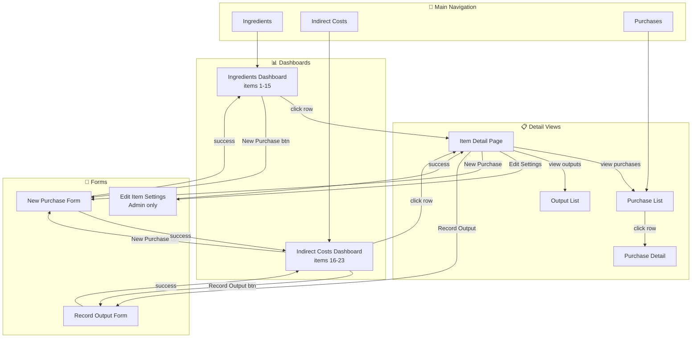
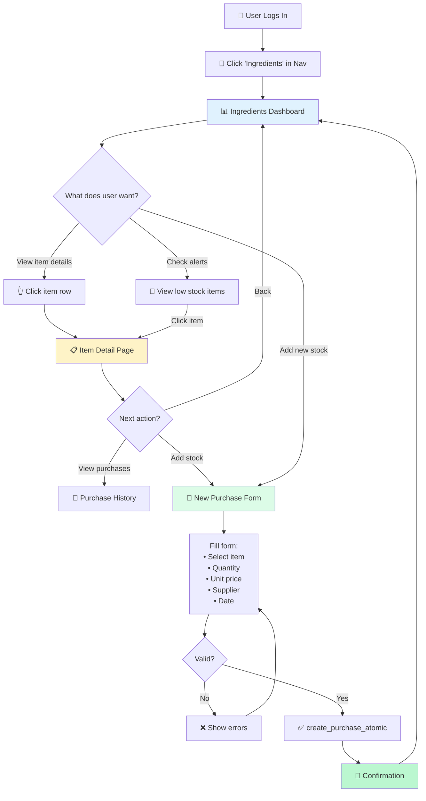
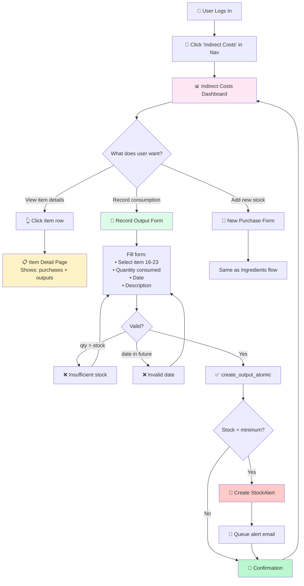
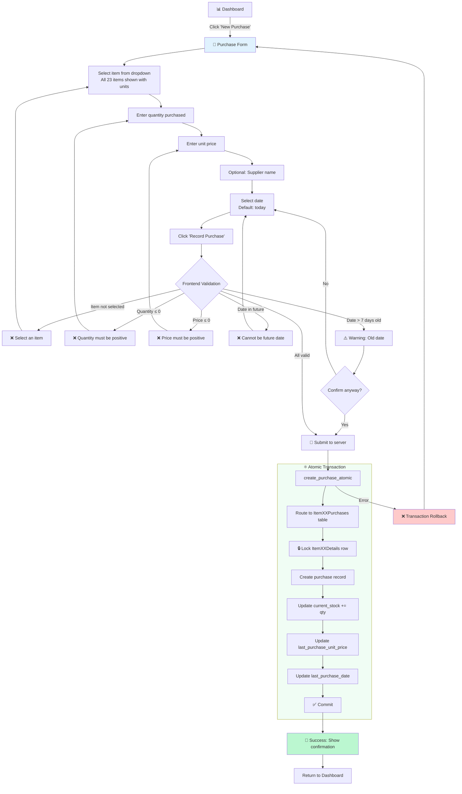
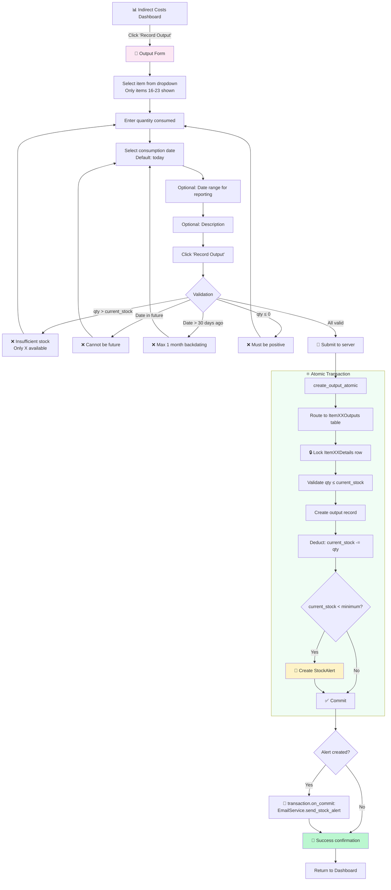
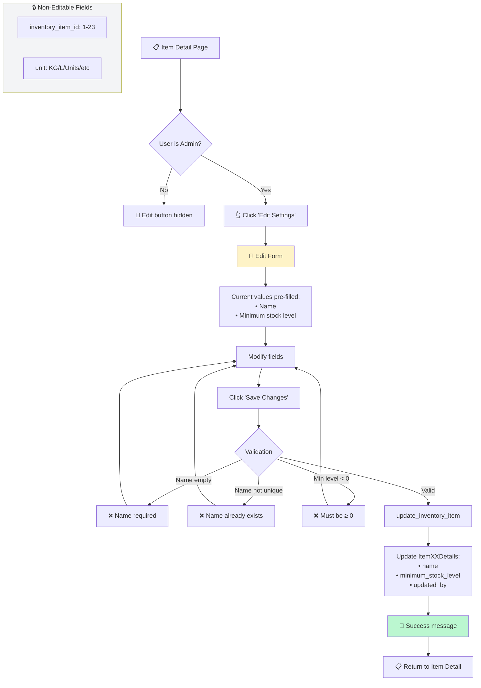
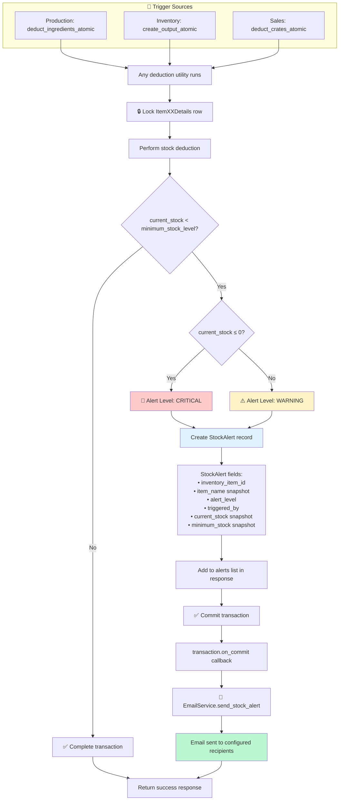
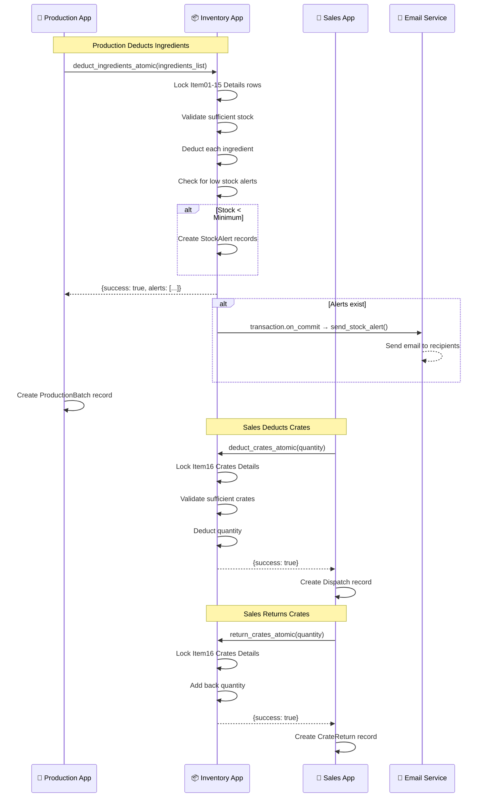
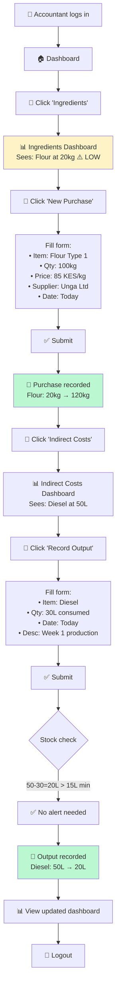

# 📦 INVENTORY APP - WORKFLOWS & INTERACTIONS

**Date:** November 28, 2025  
**Last Updated:** December 2, 2025  
**Source:** FOUNDATION_REFACTORING_PLAN.md  
**Scope:** Internal workflows + External app interactions

---

## 🆕 **RECENT UPDATES (December 2025)**

### Admin Improvements
- ✅ **Purchase Admin:** Enhanced with `item_name` display, `total_cost` calculation, date hierarchy, and list filters
- ✅ **Output Admin:** Enhanced with `item_name` display, consumption tracking, and list filters
- ✅ **Immutability Enforced:** Purchase and Output models prevent modification/deletion after creation (bank ledger model)

### Frontend Usability
- ✅ **Sidebar Navigation:** Contextual sidebar for all inventory pages (blue theme)
- ✅ **Pagination:** All list views support configurable page sizes (10, 50, 100, 500, 1000 records per page)
- ✅ **Page Size Selector:** Dropdown to change records per page, preserves filters across pagination
- ✅ **Avatar Initials:** User dropdown shows initials instead of full name (space-saving)
- ✅ **Stock Alerts:** List view with filter tabs (All/Critical/Warning) and pagination

### Views Updated
- `purchase_list()` - Pagination with page size selector
- `output_list()` - Pagination with page size selector  
- `alerts_list()` - Pagination with filter preservation (level param)

### Templates Added/Updated
- `inventory/includes/pagination.html` - Reusable pagination component
- `inventory/base_inventory.html` - Sidebar navigation base template
- All list templates now extend `base_inventory.html`

### Date/Time Standardization (Dec 2, 2025)
All inventory templates now use consistent date/time formatting:

| Field Type | Django Filter | Example Output |
|------------|---------------|----------------|
| DateField | `\|date:"M d, Y"` | Dec 02, 2025 |
| TimeField | `\|time:"g:i A"` | 3:22 PM |
| DateTimeField | `\|date:"M d, Y, g:i A"` | Dec 02, 2025, 3:22 PM |

**Templates Updated:**
- `item_detail.html` - last_purchase_date, triggered_at
- `alerts_list.html` - triggered_at
- `purchase_history.html` - purchase_date
- `output_history.html` - consumption_date, date_range fields

---

## 🎯 **OVERVIEW**

**Purpose:** Track raw materials (ingredients + indirect costs) with last purchase price costing

**Core Responsibility:**
- ✅ Manage inventory items (create, view, update metadata)
- ✅ Record purchases (immutable, timestamped)
- ✅ Track last purchase unit price (for Production mix costing)
- ✅ Deduct stock for production (via utility, locked transactions)
- ✅ Deduct/return crates for sales (via utility, locked transactions)
- ✅ Stock alerts (dashboard + real-time on production)
- ✅ Bank ledger accounting (create-only, no adjustments, no deletions)

**Costing Strategy: Last Purchase Price**
- Production uses `last_purchase_unit_price` for mix cost calculation
- Reports/Analytics query timestamped purchase history for trends
- No weighted average calculation (simpler, accurate for costing purpose)

---

## 📊 **MODELS**

### **Architecture Decision: Per-Item Physical Table Separation (Option C)**
⚠️ **CRITICAL:** Each inventory item has its own set of physical tables (NOT shared monolithic tables).

**Implementation Approach: Abstract Base + Concrete Models with Code Generation**
- Abstract base classes define common fields (DRY principle)
- Concrete model classes generated via management command (run ONCE locally, commit to Git)
- Standard Django migrations work normally
- IDE support and type hints work correctly

**Code Generation Workflow:**
1. Run ONCE locally: `python manage.py generate_inventory_models`
2. Commit generated files to Git (models + migrations)
3. Railway deploys pre-generated code (no generation on deploy)

**Inventory Item ID vs Name:**
- `inventory_item_id` (1-23) is the **permanent identifier** - never changes
- `name` is **display-only** and CAN be changed (e.g., "Flour Type 1" → "Premium Wheat Flour")
- Historical records (purchases, outputs) store `inventory_item_id`, display whatever current name is attached
- Model class names and table names don't change (cosmetic mismatch is acceptable)

**Why Physical Separation (Financial Asset Approach):**
- ✅ **Prevents Cross-Item Contamination:** Impossible to accidentally update sugar stock when recording flour purchase
- ✅ **Clean Time-Range Queries:** `SELECT * FROM inventory_item_01_flour_type_1_purchases WHERE date BETWEEN x AND y` (no item_id filtering needed)
- ✅ **Financial Asset Accountability:** Like banks with per-account ledgers—physical isolation prevents fraud/errors
- ✅ **Independent Audit Trails:** Each item's ledger is isolated, traceable, immutable

**Trade-Offs Accepted:**
- ❌ Complex routing logic (utilities must route to correct item table)
- ❌ More migrations (54 tables vs 5 shared tables)
- ❌ UNION queries for cross-item reports
- ❌ Large models.py file (~2000 lines generated)
- ✅ BUT: Overhead justified for financial-grade accountability

**File Structure:**
```
apps/inventory/
├── models/
│   ├── __init__.py          # Exports all models + routing utilities
│   ├── base.py              # Abstract base classes (DRY)
│   ├── items.py             # 23 ItemXXDetails models (generated)
│   ├── purchases.py         # 23 ItemXXPurchases models (generated)
│   ├── outputs.py           # 8 ItemXXOutputs models (indirect costs only)
│   └── alerts.py            # StockAlert (shared table)
├── routing.py               # Model routing dictionaries + helper functions
├── utils.py                 # Atomic utilities with routing logic
└── management/
    └── commands/
        └── generate_inventory_models.py  # One-time code generator
```

**Table Structure (23 Pre-Created Item Slots):**
```
INGREDIENTS (items 1-15):
├── inventory_item_XX_details (1 row per item - metadata + running totals)
│   ├── name, unit_of_measure
│   ├── current_stock (updated by: purchases +, production deduction -)
│   ├── last_purchase_unit_price (from most recent purchase)
│   ├── last_purchase_date (timestamp of most recent purchase)
│   ├── minimum_stock_level, current_value
│   └── created_at, updated_at, created_by, updated_by
│
├── inventory_item_XX_purchases (immutable ledger - bank model)
│   ├── purchase_number, supplier_name, purchase_date
│   ├── quantity_purchased, unit_price, total_cost
│   ├── purchased_by, created_at
│   └── NO UPDATES, NO DELETES (audit trail)
│
└── NO outputs table (Production app tracks usage in ProductionBatch)

INDIRECT COSTS (items 16-23):
├── inventory_item_XX_details (1 row per item - metadata + running totals)
│   ├── name, unit_of_measure
│   ├── current_stock (updated by: purchases +, outputs -)
│   ├── last_purchase_unit_price (from most recent purchase)
│   ├── last_purchase_date (timestamp of most recent purchase)
│   ├── minimum_stock_level, current_value
│   └── created_at, updated_at, created_by, updated_by
│
├── inventory_item_XX_purchases (immutable ledger - inputs)
│   ├── purchase_number, supplier_name, purchase_date
│   ├── quantity_purchased, unit_price, total_cost
│   ├── purchased_by, created_at
│   └── NO UPDATES, NO DELETES (audit trail)
│
└── inventory_item_XX_outputs (immutable ledger - consumption tracking)
    ├── output_number, consumption_date
    ├── quantity_consumed, date_range_start, date_range_end
    ├── description, consumed_by, created_at
    └── NO UPDATES, NO DELETES (audit trail)

SHARED TABLE (only 1):
├── inventory_stock_alerts (event log, points to inventory_item_id)
    ├── inventory_item_id (which item: 1-23)
    ├── alert_level, triggered_at, triggered_by (CharField: 'production', 'manual_output', etc.)
    ├── current_stock, minimum_stock (snapshots)
    └── Immutable log of all alerts across all items
```

**Pre-Created Item Slots (23 known items):**
```
INGREDIENTS (items 1-15) - NO outputs table:
  01. Flour Type 1 (kg) - 2 tables: details + purchases
  02. Flour Type 2 (kg) - 2 tables: details + purchases
  03. Sugar (kg) - 2 tables: details + purchases
  04. Bread Improver (kg) - 2 tables: details + purchases
  05. Salt (kg) - 2 tables: details + purchases
  06. Calcium (kg) - 2 tables: details + purchases
  07. Yeast (kg) - 2 tables: details + purchases
  08. Yeast 2-in-1 (kg) - 2 tables: details + purchases
  09. Baking Powder (kg) - 2 tables: details + purchases
  10. Margarine (kg) - 2 tables: details + purchases
  11. Milk (L) - 2 tables: details + purchases
  12. Eggs (units) - 2 tables: details + purchases
  13. Cooking Fat (kg) - 2 tables: details + purchases
  14. Cooking Oil (L) - 2 tables: details + purchases
  15. Food Colour (kg) - 2 tables: details + purchases

INDIRECT COSTS (items 16-23) - HAS outputs table:
  16. Crates (units) - 3 tables: details + purchases + outputs
  17. Packaging (units) - 3 tables: details + purchases + outputs
  18. Diesel (L) - 3 tables: details + purchases + outputs
  19. Firewood (units) - 3 tables: details + purchases + outputs
  20. Fuel Bolero (units) - 3 tables: details + purchases + outputs
  21. Electricity (tokens) - 3 tables: details + purchases + outputs
  22. Fuel for Transport Trucks (L) - 3 tables: details + purchases + outputs
  23. Hair Nets (units) - 3 tables: details + purchases + outputs
```

**Total Tables:** 54 tables (15×2 + 8×3 + 1 shared)

**Model Generation Approach (Option C - Abstract Base + Concrete):**
```python
# models/base.py - Abstract base classes (DRY)

from django.db import models
from django.conf import settings
from django.core.validators import MinValueValidator
from django.core.exceptions import ValidationError
from decimal import Decimal, ROUND_HALF_UP


class BaseItemDetails(models.Model):
    """Abstract base for all Item Details models (singleton per item)"""
    name = models.CharField(max_length=200)
    # NOTE: No 'category' field - ingredient vs indirect cost is determined by
    # presence in ITEM_OUTPUTS_MODELS routing dictionary (items 16-23 have outputs)
    unit_of_measure = models.CharField(max_length=20, choices=[
        ('kg', 'Kilograms'),
        ('L', 'Liters'),
        ('units', 'Units'),
        ('tokens', 'Tokens'),
    ])
    current_stock = models.DecimalField(
        max_digits=10, decimal_places=4, default=Decimal('0.0000'),
        validators=[MinValueValidator(Decimal('0.0000'))]
    )
    last_purchase_unit_price = models.DecimalField(
        max_digits=10, decimal_places=4, default=Decimal('0.0000'),
        help_text="Unit price from most recent purchase (used for Production costing)"
    )
    last_purchase_date = models.DateTimeField(
        null=True, blank=True,
        help_text="When last purchase was recorded"
    )
    minimum_stock_level = models.DecimalField(
        max_digits=10, decimal_places=4, default=Decimal('0.0000'),
        validators=[MinValueValidator(Decimal('0.0000'))]
    )
    current_value = models.DecimalField(
        max_digits=12, decimal_places=2, default=Decimal('0.00'),
        editable=False,
        help_text="Auto-calculated: current_stock × last_purchase_unit_price"
    )
    created_at = models.DateTimeField(auto_now_add=True)
    updated_at = models.DateTimeField(auto_now=True)
    created_by = models.ForeignKey(
        settings.AUTH_USER_MODEL, on_delete=models.PROTECT,
        related_name='+'
    )
    updated_by = models.ForeignKey(
        settings.AUTH_USER_MODEL, on_delete=models.PROTECT,
        null=True, blank=True, related_name='+'
    )
    
    class Meta:
        abstract = True
    
    def save(self, *args, **kwargs):
        # Auto-calculate current_value
        raw_value = self.current_stock * self.last_purchase_unit_price
        self.current_value = raw_value.quantize(Decimal('0.01'), rounding=ROUND_HALF_UP)
        super().save(*args, **kwargs)
    
    def clean(self):
        if self.current_stock < Decimal('0.0000'):
            raise ValidationError("Stock cannot be negative")


class BaseItemPurchases(models.Model):
    """Abstract base for all Item Purchases models (immutable ledger)"""
    purchase_number = models.CharField(max_length=50, unique=True)
    supplier_name = models.CharField(max_length=200, blank=True)
    purchase_date = models.DateField()
    quantity_purchased = models.DecimalField(
        max_digits=10, decimal_places=4,
        validators=[MinValueValidator(Decimal('0.0001'))]
    )
    unit_price = models.DecimalField(
        max_digits=10, decimal_places=4,
        validators=[MinValueValidator(Decimal('0.0001'))]
    )
    total_cost = models.DecimalField(
        max_digits=12, decimal_places=2, editable=False
    )
    purchased_by = models.ForeignKey(
        settings.AUTH_USER_MODEL, on_delete=models.PROTECT,
        related_name='+'
    )
    created_at = models.DateTimeField(auto_now_add=True)
    notes = models.TextField(blank=True)
    
    class Meta:
        abstract = True
        ordering = ['-purchase_date', '-created_at']
    
    def save(self, *args, **kwargs):
        # Enforce immutability
        if self.pk:
            raise ValidationError("Purchases cannot be modified after creation")
        # Auto-calculate total_cost
        self.total_cost = (self.quantity_purchased * self.unit_price).quantize(
            Decimal('0.01'), rounding=ROUND_HALF_UP
        )
        super().save(*args, **kwargs)


class BaseItemOutputs(models.Model):
    """Abstract base for Item Outputs models (indirect costs only, immutable)"""
    output_number = models.CharField(max_length=50, unique=True)
    consumption_date = models.DateField()
    quantity_consumed = models.DecimalField(
        max_digits=10, decimal_places=4,
        validators=[MinValueValidator(Decimal('0.0001'))]
    )
    date_range_start = models.DateField(null=True, blank=True)
    date_range_end = models.DateField(null=True, blank=True)
    description = models.TextField(blank=True)
    consumed_by = models.ForeignKey(
        settings.AUTH_USER_MODEL, on_delete=models.PROTECT,
        related_name='+'
    )
    created_at = models.DateTimeField(auto_now_add=True)
    
    class Meta:
        abstract = True
        ordering = ['-consumption_date', '-created_at']
    
    def save(self, *args, **kwargs):
        # Enforce immutability
        if self.pk:
            raise ValidationError("Outputs cannot be modified after creation")
        super().save(*args, **kwargs)
```

```python
# models/items.py - Concrete Details models (generated)

from .base import BaseItemDetails

class Item01FlourType1Details(BaseItemDetails):
    class Meta:
        db_table = 'inventory_item_01_flour_type_1_details'
        verbose_name = 'Flour Type 1'

class Item02FlourType2Details(BaseItemDetails):
    class Meta:
        db_table = 'inventory_item_02_flour_type_2_details'
        verbose_name = 'Flour Type 2'

# ... (generated for all 23 items)
```

```python
# models/purchases.py - Concrete Purchases models (generated)

from .base import BaseItemPurchases

class Item01FlourType1Purchases(BaseItemPurchases):
    class Meta:
        db_table = 'inventory_item_01_flour_type_1_purchases'

class Item02FlourType2Purchases(BaseItemPurchases):
    class Meta:
        db_table = 'inventory_item_02_flour_type_2_purchases'

# ... (generated for all 23 items)
```

```python
# models/outputs.py - Concrete Outputs models (indirect costs only, generated)

from .base import BaseItemOutputs

class Item16CratesOutputs(BaseItemOutputs):
    class Meta:
        db_table = 'inventory_item_16_crates_outputs'

class Item17PackagingOutputs(BaseItemOutputs):
    class Meta:
        db_table = 'inventory_item_17_packaging_outputs'

# ... (generated for items 16-23 only)
```

```python
# routing.py - Model routing dictionaries

from .models.items import *
from .models.purchases import *
from .models.outputs import *

INVENTORY_ITEMS = [
    # (id, name, is_ingredient, unit)
    (1, 'Flour Type 1', True, 'kg'),
    (2, 'Flour Type 2', True, 'kg'),
    (3, 'Sugar', True, 'kg'),
    (4, 'Bread Improver', True, 'kg'),
    (5, 'Salt', True, 'kg'),
    (6, 'Calcium', True, 'kg'),
    (7, 'Yeast', True, 'kg'),
    (8, 'Yeast 2-in-1', True, 'kg'),
    (9, 'Baking Powder', True, 'kg'),
    (10, 'Margarine', True, 'kg'),
    (11, 'Milk', True, 'L'),
    (12, 'Eggs', True, 'units'),
    (13, 'Cooking Fat', True, 'kg'),
    (14, 'Cooking Oil', True, 'L'),
    (15, 'Food Colour', True, 'kg'),
    (16, 'Crates', False, 'units'),
    (17, 'Packaging', False, 'units'),
    (18, 'Diesel', False, 'L'),
    (19, 'Firewood', False, 'units'),
    (20, 'Fuel Bolero', False, 'units'),
    (21, 'Electricity', False, 'tokens'),
    (22, 'Fuel for Transport Trucks', False, 'L'),
    (23, 'Hair Nets', False, 'units'),
]

# Mapping: inventory_item_id → model classes
ITEM_DETAILS_MODELS = {
    1: Item01FlourType1Details,
    2: Item02FlourType2Details,
    # ... all 23 items
}

ITEM_PURCHASES_MODELS = {
    1: Item01FlourType1Purchases,
    2: Item02FlourType2Purchases,
    # ... all 23 items
}

ITEM_OUTPUTS_MODELS = {
    # Only indirect costs (16-23)
    16: Item16CratesOutputs,
    17: Item17PackagingOutputs,
    18: Item18DieselOutputs,
    19: Item19FirewoodOutputs,
    20: Item20FuelBoleroOutputs,
    21: Item21ElectricityOutputs,
    22: Item22FuelTransportTrucksOutputs,
    23: Item23HairNetsOutputs,
}

def get_details_model(inventory_item_id: int):
    """Get the Details model class for an item"""
    if inventory_item_id not in ITEM_DETAILS_MODELS:
        raise ValueError(f"Unknown inventory item ID: {inventory_item_id}")
    return ITEM_DETAILS_MODELS[inventory_item_id]

def get_purchases_model(inventory_item_id: int):
    """Get the Purchases model class for an item"""
    if inventory_item_id not in ITEM_PURCHASES_MODELS:
        raise ValueError(f"Unknown inventory item ID: {inventory_item_id}")
    return ITEM_PURCHASES_MODELS[inventory_item_id]

def get_outputs_model(inventory_item_id: int):
    """Get the Outputs model class for an item (indirect costs only)"""
    if inventory_item_id not in ITEM_OUTPUTS_MODELS:
        raise ValueError(f"Item {inventory_item_id} is not an indirect cost item")
    return ITEM_OUTPUTS_MODELS[inventory_item_id]

def is_indirect_cost(inventory_item_id: int) -> bool:
    """Check if item is indirect cost (has outputs table)"""
    return inventory_item_id in ITEM_OUTPUTS_MODELS

def is_ingredient(inventory_item_id: int) -> bool:
    """Check if item is ingredient (NO outputs table, deducted by Production)"""
    return inventory_item_id not in ITEM_OUTPUTS_MODELS

def get_item_info(inventory_item_id: int) -> tuple:
    """Get (id, name, unit) for an item"""
    for item in INVENTORY_ITEMS:
        if item[0] == inventory_item_id:
            return item
    raise ValueError(f"Unknown inventory item ID: {inventory_item_id}")
```

**Ingredient vs Indirect Cost - Source of Truth:**
```python
# The routing dictionary IS the source of truth, not a database field.
# Items 1-15: NOT in ITEM_OUTPUTS_MODELS → Ingredient
# Items 16-23: IN ITEM_OUTPUTS_MODELS → Indirect Cost

# Usage:
if is_ingredient(item_id):
    # Deducted automatically by Production app
    pass
    
if is_indirect_cost(item_id):
    # Has outputs table, manual consumption tracking
    outputs_model = get_outputs_model(item_id)
```

**Adding New Items (Future):**
1. Add entry to `INVENTORY_ITEMS` list in routing.py
2. Run `python manage.py generate_inventory_models --new-only`
3. Run `python manage.py makemigrations inventory && python manage.py migrate`
4. System automatically creates required tables

---

### **Table Structure Summary**

The abstract base classes in `models/base.py` define all fields completely. Key points:

**BaseItemDetails (singleton per item):**
- `current_stock` - Running total (Decimal 4DP, min=0)
- `last_purchase_unit_price` - From most recent purchase (used for Production costing)
- `last_purchase_date` - When last purchase was recorded
- `current_value` - Auto-calculated: `current_stock × last_purchase_unit_price`
- No `category` field - use `is_ingredient()` or `is_indirect_cost()` from routing.py

**BaseItemPurchases (immutable ledger):**
- CREATE ONLY - no updates, no deletes after creation
- `total_cost` auto-calculated: `quantity_purchased × unit_price`
- Full audit trail: `purchased_by`, `created_at`, `purchase_number`

**BaseItemOutputs (indirect costs only, immutable):**
- CREATE ONLY - no updates, no deletes after creation
- For manual consumption tracking (diesel, electricity, etc.)
- Full audit trail: `consumed_by`, `created_at`, `output_number`

---

### **ItemXXPurchases Example**
**Purpose:** Immutable purchase history for each item (bank ledger model)

**Table Names:** `item_01_flour_type_1_purchases`, `item_02_flour_type_2_purchases`, ..., `item_23_hair_nets_purchases`

**Fields:**
- `purchase_number` - Auto-generated (e.g., "PUR-FLOUR-2025-11-26-001")
- `supplier_name` - Optional text field
- `purchase_date` - Date of purchase (default=today, validates not future, warn if >7 days old)
- `quantity_purchased` - Amount in standard units (Decimal, 4DP)
- `unit_price` - Price per unit at purchase time (Decimal, 4DP)
- `total_cost` - Auto-calc: quantity × unit_price (Decimal, 2DP, 2 decimals)
- `purchased_by` - User who created purchase (ForeignKey)
- `created_at` - Immutable timestamp (auto_now_add)
- `notes` - Optional details

**Validation:**
- `quantity_purchased` - MinValueValidator(Decimal('0.0001')) - must be > 0
- `unit_price` - MinValueValidator(Decimal('0.0001')) - must be > 0
- `purchase_date` - cannot be future, max 1 month backdating

**Immutability Rules:**
- ❌ **NO UPDATES ALLOWED** after creation (prevents fraud)
- ❌ **NO DELETES ALLOWED** (audit trail)
- ✅ **CREATE ONLY** (bank-like accounting model)
- ✅ **AUDIT TRAIL:** All purchases retained for accountability:
  - WHO made the purchase (`purchased_by` field)
  - WHEN it was created (`created_at` immutable timestamp)
  - WHAT was purchased (`quantity`, `unit_price`, `total_cost`)
  - Track changes to item details (`updated_by`, `updated_at` on ItemXXDetails)
  - Immutable history prevents tampering

**What It Does:**
- Records WHO bought WHAT, WHEN, and HOW MUCH (per item, isolated)
- **Immutable audit trail** (like bank account transactions)
- Source of truth for last purchase price (most recent entry's unit_price)
- Query historical prices for reports/trends analysis
- **Physically impossible to mix with other items** (flour purchases cannot touch sugar table)
- **Audit trail fields:**
  - `purchased_by` - WHO created the purchase
  - `created_at` - WHEN (immutable timestamp)
  - `purchase_number` - Unique identifier for tracking
  - Enables tracing any stock change back to source transaction

**Example:**
```python
# item_01_flour_purchases (multiple rows - ledger):
[
    {
        'purchase_number': 'PUR-FLOUR-2025-11-01-001',
        'supplier_name': 'Supplier A',
        'purchase_date': date(2025, 11, 1),
        'quantity_purchased': Decimal('50.0000'),
        'unit_price': Decimal('80.0000'),
        'total_cost': Decimal('4000.00'),
        'purchased_by': user_5,
        'created_at': datetime(2025, 11, 1, 9, 30)
    },
    {
        'purchase_number': 'PUR-FLOUR-2025-11-15-001',
        'supplier_name': 'Supplier B',
        'purchase_date': date(2025, 11, 15),
        'quantity_purchased': Decimal('75.0000'),
        'unit_price': Decimal('90.0000'),
        'total_cost': Decimal('6750.00'),
        'purchased_by': user_5,
        'created_at': datetime(2025, 11, 15, 14, 20)
    }
]
```

---

### **3. ItemXXOutputs (Per-Item Table - INDIRECT COSTS ONLY)**
**Purpose:** Manual consumption tracking for indirect costs only (8 items: Crates, Packaging, Diesel, Firewood, Fuel Bolero, Electricity, Fuel for Transport Trucks, Hair Nets)

**Table Names:** `item_16_crates_outputs`, `item_17_packaging_outputs`, `item_18_diesel_outputs`, `item_19_firewood_outputs`, `item_20_fuel_bolero_outputs`, `item_21_electricity_outputs`, `item_22_fuel_for_transport_trucks_outputs`, `item_23_hair_nets_outputs`

**Fields:**
- `output_number` - Auto-generated (e.g., "OUT-FUEL-2025-11-28-001")
- `consumption_date` - Date of consumption entry (default=today, cannot be future, max 1 month backdating)
- `quantity_consumed` - Amount consumed (Decimal, 4DP, no negatives, must be ≤ current_stock)
- `date_range_start` - Period start for consumption (DateField)
- `date_range_end` - Period end for consumption (DateField)
- `description` - Optional memo (e.g., "Fuel for bread production week 1")
- `consumed_by` - User who created entry (ForeignKey)
- `created_at` - Immutable timestamp (auto_now_add)

**Validation:**
- `quantity_consumed` - MinValueValidator(Decimal('0.0001')) - must be > 0
- `quantity_consumed` ≤ current_stock (validated in utility before creation)
- `consumption_date` - cannot be future, max 1 month backdating

**Immutability Rules:**
- ❌ **NO UPDATES ALLOWED** after creation (audit trail)
- ❌ **NO DELETES ALLOWED** (bank model)
- ✅ **CREATE ONLY** (corrections via new entry)
- ✅ **AUDIT TRAIL:** All outputs retained for accountability:
  - WHO consumed (`consumed_by` field)
  - WHEN (`created_at` immutable timestamp, `consumption_date`)
  - HOW MUCH (`quantity_consumed`)
  - Track stock changes (`updated_by` on ItemXXDetails)
  - Immutable history prevents tampering

**Auto-Deduction Logic:**
- Recording output automatically decreases `item_XX_details.current_stock`
- Example: Create output for 50L diesel → `item_18_diesel_details.current_stock -= 50.0000`
- **IMPORTANT:** Only positive values allowed (quantity_consumed > 0), stock decrease is via subtraction

**Validation:**
- `quantity_consumed` ≤ current_stock (cannot consume more than available)
- 4 decimal places precision
- No negative values
- `consumption_date` cannot be future
- `consumption_date` max 1 month backdating (consumption_date ≥ today() - 30 days)

**What It Does:**
- Tracks manual consumption of indirect costs (fuel used, electricity consumed, crates dispatched, packaging used)
- Creates immutable audit trail of when/how/who consumed indirect costs
- Enables verification: total_purchased - total_consumed = remaining_stock (manual check if needed)
- **ONLY for indirect costs** (ingredients tracked via Production app, not outputs table)
- **Audit trail fields:**
  - `consumed_by` - WHO created the output entry
  - `created_at` - WHEN (immutable timestamp)
  - `output_number` - Unique identifier for tracking
  - `description` - Optional context for the consumption

**Example:**
```python
# item_18_diesel_outputs (multiple rows - ledger):
[
    {
        'output_number': 'OUT-DIESEL-2025-11-01-001',
        'consumption_date': date(2025, 11, 1),
        'quantity_consumed': Decimal('50.0000'),
        'date_range_start': date(2025, 11, 1),
        'date_range_end': date(2025, 11, 7),
        'description': 'Diesel consumed for bread production week 1',
        'consumed_by': user_5,
        'created_at': datetime(2025, 11, 1, 16, 30)
    },
    {
        'output_number': 'OUT-DIESEL-2025-11-15-001',
        'consumption_date': date(2025, 11, 15),
        'quantity_consumed': Decimal('75.0000'),
        'date_range_start': date(2025, 11, 8),
        'date_range_end': date(2025, 11, 14),
        'description': 'Diesel consumed for mandazi production week 2',
        'consumed_by': user_5,
        'created_at': datetime(2025, 11, 15, 17, 45)
    }
]

# Reconciliation example:
# Math verification (manual check if needed):
# Total purchased (from item_18_diesel_purchases): 500.0000 L
# Total consumed (from item_18_diesel_outputs): 125.0000 L
# Remaining (item_18_diesel_details.current_stock): 375.0000 L ✅
# Formula: 500.0000 - 125.0000 = 375.0000 (matches current_stock)
```

**Why Only Indirect Costs:**
- **Ingredients:** Production app tracks usage automatically via `ProductionBatch.mix_ingredients` (no manual tracking needed)
- **Indirect Costs:** No automatic tracking mechanism (must be manually recorded by user)

**Transaction Integrity for Indirect Costs:**
```python
# CRITICAL: Both purchases and outputs update current_stock - how to ensure accuracy?

# SOLUTION: Atomic transactions with row locking

@transaction.atomic
def create_output_atomic(inventory_item_id, quantity_consumed, ...):
    # 1. Lock the details row (prevents concurrent modifications)
    details = ItemXXDetails.objects.select_for_update().get(id=inventory_item_id)
    
    # 2. Validate BEFORE creating output
    if quantity_consumed > details.current_stock:
        raise ValidationError(f"Cannot consume {quantity_consumed} - only {details.current_stock} available")
    
    # 3. Create immutable output record
    outputs_model = get_outputs_model(inventory_item_id)
    output = outputs_model.objects.create(
        output_number=generate_output_number(inventory_item_id),
        quantity_consumed=quantity_consumed,  # Always positive
        consumption_date=consumption_date,
        consumed_by=user
    )
    
    # 4. Deduct from current_stock (positive value decreases stock)
    details.current_stock -= quantity_consumed  # Stock goes down
    details.updated_by = user
    details.save()
    
    # 5. Commit - all or nothing
    return {'success': True, 'output_id': output.id}

# GUARANTEES:
# ✅ Only positive values in purchases (quantity_purchased > 0)
# ✅ Only positive values in outputs (quantity_consumed > 0)
# ✅ Stock decrease validated BEFORE output creation
# ✅ Atomic transaction prevents partial updates
# ✅ Row locking prevents concurrent modification conflicts
# ✅ Math guaranteed: current_stock = previous_stock - quantity_consumed
```

**Decimal Precision & Rounding:**
```python
# All monetary/quantity values use DecimalField with fixed precision
# This prevents floating-point errors and ensures accuracy

class ItemXXPurchases(models.Model):
    quantity_purchased = DecimalField(
        max_digits=10, 
        decimal_places=4,  # 4 decimal places (e.g., 123.4567)
        validators=[MinValueValidator(Decimal('0.0001'))]
    )
    unit_price = DecimalField(
        max_digits=10,
        decimal_places=4,  # 4 decimal places
        validators=[MinValueValidator(Decimal('0.0001'))]
    )
    total_cost = DecimalField(
        max_digits=12,
        decimal_places=2  # 2 decimal places for currency (e.g., KES 1234.56)
    )
    
    def save(self, *args, **kwargs):
        # Auto-calculate with proper rounding
        self.total_cost = (self.quantity_purchased * self.unit_price).quantize(
            Decimal('0.01'),  # Round to 2 decimal places
            rounding=ROUND_HALF_UP  # Standard commercial rounding
        )
        super().save(*args, **kwargs)

class ItemXXDetails(models.Model):
    current_stock = DecimalField(
        max_digits=10,
        decimal_places=4,  # 4 decimal places
        validators=[MinValueValidator(Decimal('0.0000'))]  # Can be 0 but not negative
    )
    last_purchase_unit_price = DecimalField(
        max_digits=10,
        decimal_places=4  # 4 decimal places
    )
    current_value = DecimalField(
        max_digits=12,
        decimal_places=2,  # Currency: 2 decimal places
        editable=False
    )
    
    def save(self, *args, **kwargs):
        # Auto-calculate current_value with rounding
        self.current_value = (self.current_stock * self.last_purchase_unit_price).quantize(
            Decimal('0.01'),
            rounding=ROUND_HALF_UP
        )
        super().save(*args, **kwargs)

# ROUNDING STRATEGY:
# ✅ Quantities: 4 decimal places (0.0001 precision)
# ✅ Unit prices: 4 decimal places (0.0001 precision)
# ✅ Money amounts: 2 decimal places (0.01 precision - standard currency)
# ✅ Rounding method: ROUND_HALF_UP (commercial standard: 0.5 → 1)
# ✅ Zero prevention: MinValueValidator(0.0001) ensures no zero costs
```

**Validation Rules (Ensures All Positive Values):**
```python
# Model-level validators:
class ItemXXPurchases(models.Model):
    quantity_purchased = DecimalField(
        validators=[MinValueValidator(Decimal('0.0001'))]  # Must be > 0, prevents zero
    )
    unit_price = DecimalField(
        validators=[MinValueValidator(Decimal('0.0001'))]  # Must be > 0, prevents zero
    )

class ItemXXOutputs(models.Model):
    quantity_consumed = DecimalField(
        validators=[MinValueValidator(Decimal('0.0001'))]  # Must be > 0, prevents zero
    )

class ItemXXDetails(models.Model):
    current_stock = DecimalField(
        validators=[MinValueValidator(Decimal('0.0000'))]  # Can be 0 but not negative
    )
    
    def clean(self):
        # Additional check: current_stock should never go negative
        if self.current_stock < Decimal('0.0000'):
            raise ValidationError("Stock cannot be negative")
```

**Current Value Calculation (Always Accurate):**
```python
# Auto-calculated on every save (no manual intervention):
class ItemXXDetails(models.Model):
    current_stock = DecimalField(max_digits=10, decimal_places=4)
    last_purchase_unit_price = DecimalField(max_digits=10, decimal_places=4)
    current_value = DecimalField(max_digits=12, decimal_places=2, editable=False)
    
    def save(self, *args, **kwargs):
        # Recalculate current_value BEFORE saving with proper rounding
        raw_value = self.current_stock * self.last_purchase_unit_price
        self.current_value = raw_value.quantize(
            Decimal('0.01'),  # Round to 2 decimal places (currency)
            rounding=ROUND_HALF_UP
        )
        super().save(*args, **kwargs)

# RESULT: current_value always = current_stock × last_purchase_unit_price (rounded to 2DP)
# Even when stock changes via purchases OR outputs
```

---

### **4. StockAlert (Shared Table - Event Log)**
**Purpose:** ✅ **STORE NOW, NOT LATER** - Track alert history across all items

**Table Name:** `stock_alerts` (ONE shared table for all 23 items)

**Fields:**
- `inventory_item_id` - Integer (1-23, which item triggered alert)
- `item_name` - CharField (snapshot of item name at alert time)
- `alert_level` - Choices: 'WARNING' (low), 'CRITICAL' (out of stock)
- `triggered_at` - DateTimeField(auto_now_add=True) - **Immutable timestamp**
- `triggered_by` - CharField - Source of deduction: 'production', 'manual_output', 'sales', etc.
- `triggered_by_user` - FK to User (who initiated the deduction)
- `current_stock` - DecimalField - **Snapshot** of stock at alert time
- `minimum_stock` - DecimalField - **Snapshot** of threshold at alert time
- `message` - TextField - Full alert message for email/display
- `email_sent` - BooleanField(default=False) - Was email sent?
- `created_at` - DateTimeField(auto_now_add=True)

**Note:** No FK to ProductionBatch - this would create circular dependency (inventory → production). 
The `triggered_by` CharField stores the source context without coupling to other apps.

**Immutability:**
- ❌ **NO UPDATES** - Once created, immutable
- ❌ **NO DELETES** - Audit trail of all alerts
- ✅ **CREATE ONLY** - Appended to log
- ✅ **AUDIT TRAIL:** All alerts retained for accountability:
  - SOURCE of deduction (`triggered_by`: 'production', 'manual_output', etc.)
  - WHO initiated (`triggered_by_user`)
  - WHEN alert occurred (`triggered_at` immutable timestamp)
  - Stock snapshot at alert time (`current_stock`, `minimum_stock`)

**Why Shared (Not Per-Item):**
- ✅ Alerts are **event logs**, not transactional data
- ✅ Cross-item analysis: "How many alerts this week?" (all items)
- ✅ Efficient querying: `SELECT * FROM stock_alerts WHERE triggered_at > NOW() - INTERVAL '7 days'`
- ✅ No integrity compromise: `inventory_item_id` field links to specific item
- ✅ **Audit trail:** Track what operations caused stock depletion

**Example:**
```python
# Alert triggered by production deduction
StockAlert.objects.create(
    inventory_item_id=1,  # Bakers Flour
    item_name='Bakers Flour',
    alert_level='WARNING',
    triggered_by='production',
    triggered_by_user=john,
    current_stock=Decimal('45.0000'),
    minimum_stock=Decimal('50.0000'),
    message="Bakers Flour: 45.0000 kg (Min: 50.0000)",
    email_sent=False
)

# Alert triggered by manual output (indirect cost)
StockAlert.objects.create(
    inventory_item_id=18,  # Diesel
    item_name='Diesel',
    alert_level='CRITICAL',
    triggered_by='manual_output',
    triggered_by_user=jane,
    current_stock=Decimal('0.0000'),
    minimum_stock=Decimal('20.0000'),
    message="Diesel: 0.0000 L (Min: 20.0000) - OUT OF STOCK",
    email_sent=False
)
```

**Race Condition Prevention:**
- ✅ StockAlert creation is **INSIDE** the deduction transaction (ACID)
- ✅ Alert is created atomically with stock change
- ✅ Multiple alerts for same item = OK (just appended to log)

---

### **5. InventoryAdjustment**
**Purpose:** ❌ **REMOVED - NOT ALLOWED IN BANK LEDGER MODEL**

**Rationale:**
- ✅ **POSITIVE VALUES ONLY:** All quantities, prices, costs must be > 0 (MinValueValidator enforced)
- ✅ **NO NEGATIVE PURCHASES:** Cannot use negative purchases for adjustments (breaks accounting integrity)
- ✅ **NO UPDATES/DELETES:** Immutable ledger prevents fraud

**Correct Approach for Stocktake Discrepancies:**
1. **Physical Count Shows Missing Stock:**
   - DO NOT adjust existing records
   - Document in manual stocktake report (external to system)
   - Investigate loss/theft/damage
   - Future purchases will update last_purchase_unit_price naturally

2. **Physical Count Shows Extra Stock:**
   - Create NEW purchase with realistic unit_price (purchase invoice)
   - Use supplier "INTERNAL: Stocktake Found Item"
   - Requires proper documentation (where did item come from?)

**Why No Adjustments:**
- ✅ Banks don't "adjust" transactions after the fact
- ✅ Audit trail must be unbroken
- ✅ All stock changes must have paper trail (purchase invoice, production batch, output record)
- ✅ Prevents hiding theft/fraud via "adjustments"

**No InventoryAdjustment Model** ✅

---

## 🔧 **INTERNAL WORKFLOWS (Inventory App Only)**

### **Note: Pre-Defined Inventory Items (No User Creation)**

All 23 inventory items are **pre-defined at code generation time** via `generate_inventory_models.py`. 
Users do NOT create inventory items - they are hardcoded with:
- Fixed `inventory_item_id` (1-23)
- Fixed `name` (can be updated via admin if needed)
- Fixed `unit` (KG, Liters, Units, etc.)
- Initial values: `current_stock=0`, `last_purchase_unit_price=0`

This is a **one-time local development process**, not a runtime operation.
See: [Code Generation Workflow](#code-generation-workflow-one-time-local-development)

---

### **Workflow 1: Update Inventory Item Settings**

**View:** `update_inventory_item()`  
**Permission:** Admin only  
**Method:** POST

**Purpose:** Allow admins to update item settings (name, minimum_stock_level) if needed.

**Editable Fields:**
- `name` - Display name (can change, `inventory_item_id` is permanent identifier)
- `minimum_stock_level` - Threshold for low stock alerts

**Non-Editable Fields (set at migration):**
- `inventory_item_id` - Permanent identifier (1-23)
- `unit` - Fixed unit of measurement

**Steps:**
1. Admin selects item from dropdown
2. Updates name and/or minimum_stock_level
3. Validate: name unique, minimum_stock_level ≥ 0
4. Save changes with updated_by = request.user
5. Redirect to dashboard

**Models Used:**
- ItemXXDetails (UPDATE: name, minimum_stock_level, updated_by)

---

### **Workflow 2: View Inventory Dashboards**

**Note:** Ingredients and Indirect Costs have different data structures and require separate dashboard views.

#### **2A: Ingredients Dashboard**

**View:** `ingredients_dashboard()`  
**Permission:** Any authenticated user  
**Method:** GET

**Purpose:** Display stock levels for ingredients (items 1-15) used in production.

**Steps:**
1. Query ItemXXDetails for items 1-15 (via routing)
2. Identify low stock items: `current_stock < minimum_stock_level`
3. Separate: critical (stock ≤ 0) vs warning (stock < minimum)
4. Display with color-coded alerts

**Columns Displayed:**
| Item | Current Stock | Unit | Min Level | Last Price | Status |
|------|---------------|------|-----------|------------|--------|
| Bakers Flour | 150.00 | KG | 50.00 | 85.00 | ✅ OK |
| Sugar | 25.00 | KG | 30.00 | 120.00 | ⚠️ LOW |

**Models Used:**
- Item01Details through Item15Details (READ)

#### **2B: Indirect Costs Dashboard**

**View:** `indirect_costs_dashboard()`  
**Permission:** Any authenticated user  
**Method:** GET

**Purpose:** Display stock levels and consumption tracking for indirect costs (items 16-23).

**Steps:**
1. Query ItemXXDetails for items 16-23 (via routing)
2. Query recent outputs from ItemXXOutputs tables
3. Identify low stock items
4. Display with consumption history summary

**Columns Displayed:**
| Item | Current Stock | Unit | Min Level | Last Price | Recent Usage | Status |
|------|---------------|------|-----------|------------|--------------|--------|
| Diesel | 45.00 | Liters | 20.00 | 180.00 | 15L this week | ✅ OK |
| Firewood | 5.00 | Units | 10.00 | 500.00 | 3 this week | ⚠️ LOW |

**Models Used:**
- Item16Details through Item23Details (READ)
- Item16Outputs through Item23Outputs (READ - for usage summary)

**Output:**
- Dashboard showing current stock levels
- Alert badges for low/critical items
- Quick restock links
- (Indirect costs only) Recent consumption summary

---

### **Workflow 3: Create Purchase (Single Item)**

**View:** `create_purchase()`  
**Permission:** Accountant or Admin  
**Method:** POST

**Purpose:** Record a purchase of ONE inventory item at a time.

**Form Fields:**
- `inventory_item_id` - **Dropdown**: Select one item from all 23 items
- `quantity_purchased` - Decimal(10, 4) - must be > 0
- `unit_price` - Decimal(10, 4) - price per unit, must be > 0
- `supplier_name` - Optional text field
- `purchase_date` - Default=today(), cannot be future, warn if >7 days old

**Steps:**
1. User selects ONE item from dropdown (shows all 23 items with their units)
2. Enters quantity purchased and unit price
3. Optionally enters supplier name
4. Selects purchase date (default=today)
5. Validate:
   - Item exists (valid inventory_item_id 1-23)
   - Quantity > 0
   - Unit price > 0
   - purchase_date not in future
   - Warn if purchase_date > 7 days old
6. Click "Record Purchase"
7. Call utility: `create_purchase_atomic()`
8. Utility steps:
   a. Route to correct tables based on inventory_item_id
   b. Lock ItemXXDetails row (select_for_update)
   c. Create ItemXXPurchases record (immutable)
   d. Update ItemXXDetails:
      - `current_stock += quantity_purchased`
      - `last_purchase_unit_price = unit_price` (simple overwrite)
      - `last_purchase_date = purchase_date`
      - `updated_by = request.user`
   e. Commit transaction (all-or-nothing)
9. Redirect to purchase confirmation page

**Models Used:**
- ItemXXPurchases (CREATE) - one record per purchase
- ItemXXDetails (UPDATE: current_stock, last_purchase_unit_price, last_purchase_date, updated_by)

**Utility Called:**
- `create_purchase_atomic(inventory_item_id, supplier_name, quantity_purchased, unit_price, purchase_date, user)`

**Output:**
- Immutable purchase record (CREATE ONLY)
- Updated inventory stock level
- **Updated last purchase price (simple overwrite, no averaging)**

**Note:** To record multiple items from the same supplier on the same day, submit the form multiple times (once per item). Each purchase is an independent transaction for ACID compliance.

**Purchase Utility Implementation:**
```python
@transaction.atomic
def create_purchase_atomic(inventory_item_id, supplier_name, quantity_purchased, unit_price, purchase_date, requested_by_user):
    """
    Create purchase for specific inventory item (routes to correct per-item table).
    
    Args:
        inventory_item_id: Integer 1-23 (which item)
        supplier_name: String (supplier/vendor name)
        quantity_purchased: Decimal (amount purchased, must be > 0)
        unit_price: Decimal (price per unit, must be > 0)
        purchase_date: Date (when purchased)
        requested_by_user: User (who created purchase)
    
    Returns:
        dict: {'success': True, 'data': {'purchase_number': str}}
    """
    from .routing import get_details_model, get_purchases_model
    from django.utils import timezone
    from decimal import Decimal, ROUND_HALF_UP
    
    # Route to correct item tables based on Inventory Item ID
    ItemDetailsModel = get_details_model(inventory_item_id)
    ItemPurchasesModel = get_purchases_model(inventory_item_id)
    
    # Lock item details row (singleton)
    item = ItemDetailsModel.objects.select_for_update().get(id=1)
    
    # Validate: positive values only
    if quantity_purchased <= 0 or unit_price <= 0:
        raise ValidationError("Quantity and price must be positive")
    
    # Auto-calculate total cost with rounding
    total_cost = (quantity_purchased * unit_price).quantize(
        Decimal('0.01'),
        rounding=ROUND_HALF_UP
    )
    
    # Generate purchase number (item-specific)
    purchase_number = f"PUR-{item.name.upper().replace(' ', '_')}-{purchase_date.strftime('%Y-%m-%d')}-{ItemPurchasesModel.objects.count() + 1:03d}"
    
    # Create purchase record (immutable)
    purchase = ItemPurchasesModel.objects.create(
        purchase_number=purchase_number,
        supplier_name=supplier_name,
        purchase_date=purchase_date,
        quantity_purchased=quantity_purchased,
        unit_price=unit_price,
        total_cost=total_cost,
        purchased_by=requested_by_user
    )
    
    # Update stock
    item.current_stock += quantity_purchased
    
    # Update last purchase price (simple overwrite - no averaging)
    item.last_purchase_unit_price = unit_price
    item.last_purchase_date = timezone.now()
    
    item.updated_by = requested_by_user
    item.save()  # current_value auto-calculated in save()
    
    return {'success': True, 'data': {'purchase_number': purchase_number}}
```

**Example:**
```
SCENARIO: Last Purchase Price (Simple)

October 29: Buy 50kg @ KES 80/kg
  → item.last_purchase_unit_price = 80.0000
  
November 15: Buy 50kg @ KES 90/kg
  → item.last_purchase_unit_price = 90.0000 (overwrites 80)
  
November 28: Buy 50kg @ KES 85/kg
  → item.last_purchase_unit_price = 85.0000 (overwrites 90)

PRODUCTION MIX (Nov 29) uses: KES 85/kg for cost calculation

PRICE TREND REPORTS query: ItemXXPurchases table directly
  - Get all purchases in date range
  - Show price history: 80 → 90 → 85
  - Calculate averages if needed for report
```

---

### **Workflow 4: Record Indirect Cost Outputs (Manual Consumption)**

**View:** `record_output()`  
**Permission:** Accountant or Admin  
**Method:** POST

**Purpose:** Manually track consumption of indirect costs (Crates, Packaging, Diesel, Firewood, Fuel Bolero, Electricity, Fuel for Transport Trucks, Hair Nets)

**Applies To:** ONLY indirect costs (items 16-23)
- ✅ Crates (item_16) - if not auto-tracked via Sales
- ✅ Packaging (item_17) - if not auto-tracked via Production
- ✅ Diesel (item_18)
- ✅ Firewood (item_19)
- ✅ Fuel Bolero (item_20)
- ✅ Electricity (item_21)
- ✅ Fuel for Transport Trucks (item_22)
- ✅ Hair Nets (item_23)
- ❌ NOT for ingredients (items 1-15 tracked automatically via Production app)

**Form Fields:**
- `inventory_item_id` - Dropdown: [16-Crates, 17-Packaging, 18-Diesel, 19-Firewood, 20-Fuel Bolero, 21-Electricity, 22-Fuel for Transport Trucks, 23-Hair Nets]
- `quantity_consumed` - Decimal(10, 4) - must be ≤ current_stock
- `consumption_date` - Default=today(), cannot be future, max 1 month backdating
- `date_range_start` - Period start (optional, for reporting)
- `date_range_end` - Period end (optional, for reporting)
- `description` - Optional memo (e.g., "Fuel for bread production week 1")

**Steps:**
1. User selects indirect cost item from dropdown (only items 16-23 shown)
2. Enters quantity consumed (validates ≤ current_stock)
3. Selects consumption date (default=today, validates not future, max 1 month back)
4. Optional: Enters date range for reporting (week, month, custom)
5. Optional: Enters description
6. Clicks "Record Output"
7. Call utility: `create_output_atomic()`
8. Utility steps:
   a. Route to correct outputs table based on inventory_item_id (e.g., `item_18_diesel_outputs` for Item ID 18)
   b. Lock ItemXXDetails row (select_for_update)
   c. Validate:
      - Item is indirect cost (is_indirect_cost(item_id) returns True)
      - quantity_consumed ≤ current_stock
      - consumption_date not future
      - consumption_date ≥ today() - 30 days
   d. Create ItemXXOutputs record (immutable)
   e. Deduct from ItemXXDetails.current_stock -= quantity_consumed
   f. Update ItemXXDetails.updated_by = user
   g. Commit transaction
9. Show confirmation: "Recorded {quantity} {unit} consumption for {item_name}"

**Models Used:**
- ItemXXOutputs (CREATE) - e.g., `item_18_diesel_outputs`
- ItemXXDetails (UPDATE: current_stock, updated_by) - e.g., `item_18_diesel_details`

**Utility Called:**
- `create_output_atomic(inventory_item_id, quantity_consumed, consumption_date, date_range_start, date_range_end, description, user)`

**Output:**
- Immutable output record (audit trail)
- Updated stock level (automatically deducted)
- Math verification: total_purchased - total_consumed = current_stock (can be manually checked if needed)

**Example:**
- ✅ 4 decimal places precision
- ✅ No negative values (MinValueValidator(Decimal('0.0001')) - must be > 0)
- ✅ quantity_consumed ≤ current_stock (prevents over-consumption)
- ✅ consumption_date ≤ today() (no future dates)
- ✅ consumption_date ≥ today() - 30 days (max 1 month backdating)
- ✅ Immutable: NO UPDATES, NO DELETES (bank model)

**Example:**
```python
# User records diesel consumption:
create_output_atomic(
    inventory_item_id=18,  # Diesel
    quantity_consumed=Decimal('50.0000'),
    consumption_date=date.today(),
    date_range_start=date(2025, 11, 1),
    date_range_end=date(2025, 11, 7),
    description='Diesel consumed for bread production week 1',
    user=request.user
)

# Creates in item_18_diesel_outputs:
{
    'output_number': 'OUT-DIESEL-2025-11-28-001',
    'quantity_consumed': Decimal('50.0000'),
    'consumption_date': date(2025, 11, 28),
    'date_range_start': date(2025, 11, 1),
    'date_range_end': date(2025, 11, 7),
    'description': 'Diesel consumed for bread production week 1',
    'consumed_by': user_5,
    'created_at': datetime(2025, 11, 28, 14, 30)
}

# Updates item_18_diesel_details:
current_stock: 400.0000 → 350.0000 L (automatically deducted)
```

**Validation Rules:**

### **Workflow 5: View Purchase History**

**View:** `purchase_list()`, `purchase_detail()`  
**Permission:** Accountant or Admin  
**Method:** GET

**Steps:**
1. Query all Purchases (ordered by date DESC)
2. Display: purchase_number, date, supplier, total_amount
3. Detail view shows PurchaseItems:
   - Item name, quantity, unit_price, total_cost
4. Can filter by date range, supplier, item

**Models Used:**
- ItemXXPurchases (READ) - per-item purchase history
- ItemXXDetails (READ - for item metadata)
- ItemXXOutputs (READ - for indirect cost consumption, if applicable)

**Output:**
- Historical purchase records
- Price trend analysis (same item over time)

---

### **Workflow 6: View Inventory Item Detail**

**View:** `inventory_item_detail()`  
**Permission:** Any authenticated user  
**Method:** GET

**Steps:**
1. Get InventoryItem by ID
2. Query related data:
   - Recent purchases (last 10 PurchaseItems)
   - Stock alerts (if any active alerts)
3. Display:
   - Current stock, last purchase unit price, current value
   - Stock alert badge (if low/critical)
   - Purchase history chart (price trends)
   - Last purchase date

**Models Used:**
- ItemXXDetails (READ)
- ItemXXPurchases (READ - recent purchases)
- ItemXXOutputs (READ - for indirect costs only)
- StockAlert (READ - current alerts)

**Output:**
- Detailed item profile
- Historical context (purchases, alerts)
- Alert status

---

## 🔗 **EXTERNAL WORKFLOWS (Cross-App Interactions)**

### **External Workflow 1: Production Deducts Ingredients**

**Caller:** Production app (`create_production_batch_atomic()`)  
**Utility:** `deduct_ingredients_atomic()`

**Flow:**
```
Production App → Inventory Utility → InventoryItem
```

**Steps:**
1. Production calls: `deduct_ingredients_atomic(ingredients_list, 'production', user)`
2. Utility validates:
   - All items exist
   - Sufficient stock available
3. Utility locks rows (select_for_update)
4. Utility deducts:
   - For each ingredient: `current_stock -= quantity_required`
   - Update `updated_by = user`
5. Utility returns:
   ```python
   {
       'success': True,
       'data': {'deducted_items': 5}
   }
   ```
6. Production creates ProductionBatch (only if inventory deduction succeeded)

**Models Used:**
- ItemXXDetails (UPDATE: current_stock, updated_by) - per-item stock updates

**Critical Integration Note - How Production Tracks Ingredients:**
With per-item table architecture, ProductionBatch cannot use ForeignKey to unified InventoryItem.  
Instead, Production app stores ingredient references as:
- **Option 1 (JSONField):** Store inventory item IDs in ProductionBatch as JSONField:
  ```python
  class ProductionBatch(models.Model):
      ingredient_slots = models.JSONField()  # [{'inventory_item_id': 1, 'quantity': 5.0}, ...]
  ```
- **Option 2 (MixIngredient with inventory_item_id field):**
  ```python
  class MixIngredient(models.Model):
      mix = models.ForeignKey(Mix)
      inventory_item_id = models.IntegerField()  # 1-23, which ingredient
      quantity_per_batch = models.DecimalField()
  ```

This solves the "no FK to InventoryItem" problem in per-item architecture.

**Utility Function Interface:**
```python
@transaction.atomic
def deduct_ingredients_atomic(
    ingredients_list,  # [{'inventory_item_id': 1, 'quantity': 5.0000}, ...] - uses Inventory Item ID (1-23)
    requested_by_app='production',
    requested_by_user=None
):
    """
    Deduct multiple ingredients atomically.
    
    Args:
        ingredients_list: List of dicts with 'inventory_item_id' (Integer 1-23) and 'quantity' (Decimal)
        requested_by_app: String ('production', 'sales', etc.)
        requested_by_user: User instance
    
    Returns:
        {'success': True/False, 'data': {...} or 'error': str}
    
    Routing Logic:
        - For each ingredient, get model via get_item_details_model(inventory_item_id)
        - Example: inventory_item_id=1 → Item01FlourType1Details
        - Lock row with select_for_update()
        - Validate sufficient stock
        - Deduct and save
    """
    # Validate, lock, deduct, return
```

**Transaction Guarantee:**
- If ANY ingredient has insufficient stock → entire transaction rolls back
- All-or-nothing: either all ingredients deducted OR none

**Example:**
```
Production wants to make Bread Batch #45:
  - Flour Type 1 (Inventory Item ID 1): 5.0000 kg
  - Sugar (Inventory Item ID 3): 0.5000 kg
  - Yeast (Inventory Item ID 7): 0.0500 kg

Inventory checks:
  - Item01FlourType1Details: 12.0000 kg ✅ (enough)
  - Item03SugarDetails: 2.0000 kg ✅ (enough)
  - Item07YeastDetails: 0.0500 kg ✅ (exactly enough)

Inventory deducts:
  - Flour Type 1: 12.0000 → 7.0000 kg
  - Sugar: 2.0000 → 1.5000 kg
  - Yeast: 0.0500 → 0.0000 kg ⚠️ (triggers alert)

Returns: {'success': True}

Production creates Batch #45
```

---

### **External Workflow 2: Sales Deducts Crates**

**Caller:** Sales app (`assign_crates_to_dispatch_atomic()`)  
**Utility:** `deduct_crates_atomic()`

**Flow:**
```
Sales App → Inventory Utility → Item16CratesDetails
```

**Steps:**
1. Sales calls: `deduct_crates_atomic(inventory_item_id=16, quantity=10, requested_by_app='sales', user=user)`
2. Utility validates:
   - Inventory Item ID 16 (Crates) exists and is active
   - Sufficient crates available
3. Utility locks row (select_for_update on Item16CratesDetails)
4. Utility deducts: `current_stock -= quantity`
5. Utility returns success/error
6. Sales creates DispatchCrate record (only if deduction succeeded)

**Models Used:**
- Item16CratesDetails (UPDATE: current_stock, updated_by)

**Utility Function Interface:**
```python
@transaction.atomic
def deduct_crates_atomic(
    inventory_item_id,  # Integer (typically 16 for Crates, but flexible)
    quantity,  # Decimal - amount to deduct
    requested_by_app='sales',
    requested_by_user=None
):
    """
    Deduct crates from inventory (Item ID 16).
    
    Args:
        inventory_item_id: Integer (16 for Crates)
        quantity: Decimal amount to deduct
        requested_by_app: String ('sales', etc.)
        requested_by_user: User instance
    
    Returns:
        {'success': True/False, 'data': {...} or 'error': str}
    
    Routing:
        - get_item_details_model(16) → Item16CratesDetails
        - Lock with select_for_update()
    """
    # Validate, lock, deduct, return
```

**Example:**
```
Sales wants to dispatch 10 bread crates:

Inventory checks:
  - Bread Crate: 150 units ✅ (enough)

Inventory deducts:
  - Bread Crate: 150 → 140 units

Returns: {'success': True}

Sales creates DispatchCrate record
```

---

### **External Workflow 3: Sales Returns Crates**

**Caller:** Sales app (`process_return_atomic()`)  
**Utility:** `return_crates_atomic()`

**Flow:**
```
Sales App → Inventory Utility → Item16CratesDetails
```

**Steps:**
1. Sales calls: `return_crates_atomic(inventory_item_id=16, quantity=5, requested_by_app='sales', user=user)`
2. Utility locks row (select_for_update on Item16CratesDetails)
3. Utility adds back: `current_stock += quantity`
4. Utility returns success
5. Sales creates CrateReturn record

**Models Used:**
- Item16CratesDetails (UPDATE: current_stock, updated_by)

**Utility Function Interface:**
```python
@transaction.atomic
def return_crates_atomic(
    inventory_item_id,  # Integer (typically 16 for Crates)
    quantity,  # Decimal - amount to return
    requested_by_app='sales',
    requested_by_user=None
):
    """
    Return crates to inventory (Item ID 16).
    
    Args:
        inventory_item_id: Integer (16 for Crates)
        quantity: Decimal amount to add back
        requested_by_app: String ('sales', etc.)
        requested_by_user: User instance
    
    Returns:
        {'success': True}
    
    Routing:
        - get_item_details_model(16) → Item16CratesDetails
        - Lock with select_for_update()
    """
    # Lock, add back, return
```

**Example:**
```
Sales return: 5 bread crates returned (out of 10 dispatched)

Inventory adds:
  - Bread Crate: 140 → 145 units

Returns: {'success': True}

Sales marks: 5 missing (dispatched - returned = 10 - 5 = 5)
```

---

### **External Workflow 4: Stock Alerts (Triggered by Deductions)**

**Trigger:** Any stock deduction via `deduct_ingredients_atomic()` or `create_output_atomic()`
**Owner:** Inventory app (100% internal operation)
**Purpose:** Create StockAlert record when stock falls below minimum level

**⚠️ CLARIFICATION - Stock Alerts are an Inventory Operation:**
- **StockAlert creation happens INSIDE inventory utilities** during deduction
- This is purely an inventory responsibility - the calling app (Production, etc.) is NOT involved
- Alerts are created atomically with stock changes (ACID compliance)
- This avoids the need for cron jobs - alerts are created in real-time when conditions are met

**Flow:**
```
Any deduction utility runs → Check stock vs minimum → If low, create StockAlert → Return result
```

**Steps (inside `deduct_ingredients_atomic()` or `create_output_atomic()`):**
1. Deduct stock for each item
2. After each deduction, check: `if item.current_stock < item.minimum_stock_level:`
3. If true, create StockAlert record (within same transaction):
   - `inventory_item_id` = item ID
   - `alert_level` = 'CRITICAL' if stock ≤ 0, else 'WARNING'
   - `current_stock` = snapshot at time of alert
   - `minimum_stock_level` = threshold that was breached
   - `triggered_by` = source of deduction ('production', 'manual_output', etc.)
   - `created_at` = timestamp
4. Collect alerts in return value for UI display/email
5. Utility returns:
   ```python
   {
       'success': True,
       'data': {
           'deducted_items': 3,
           'alerts': [  # List of created StockAlert records
               {'inventory_item_id': 1, 'item_name': 'Bakers Flour', 'alert_level': 'WARNING', 'current_stock': 7.0}
           ]
       }
   }
   ```

**Models Used:**
- ItemXXDetails (UPDATE: current_stock; READ: minimum_stock_level)
- StockAlert (CREATE - by inventory utility)

**Email Sending (DRY - Use Existing EmailService):**
The `communications` app already has a centralized `EmailService` class used by accounts.
Add a new method for stock alerts:

```python
# apps/communications/services/email.py (add to existing EmailService class)

@staticmethod
def send_stock_alert(recipients, alerts, triggered_by_user=None):
    """
    Send stock alert notification email
    
    Args:
        recipients: List of email addresses (configured alert recipients)
        alerts: List of alert dicts from inventory utility
        triggered_by_user: User who initiated the operation
    
    Returns:
        bool: Success status
    """
    # Group alerts by level
    critical = [a for a in alerts if a['alert_level'] == 'CRITICAL']
    warnings = [a for a in alerts if a['alert_level'] == 'WARNING']
    
    context = {
        'critical_alerts': critical,
        'warning_alerts': warnings,
        'total_alerts': len(alerts),
        'triggered_by': triggered_by_user.get_full_name() if triggered_by_user else 'System',
        'timestamp': timezone.now(),
        'dashboard_url': settings.SITE_URL + '/inventory/dashboard/',
    }
    
    subject = f"🚨 Stock Alert: {len(critical)} Critical, {len(warnings)} Warning"
    
    for recipient in recipients:
        EmailService._send_email(
            recipient=recipient,
            subject=subject,
            template_name='emails/inventory/stock_alert.html',
            context=context,
            sent_by=triggered_by_user
        )
    
    return True
```

**Template:** `apps/communications/templates/communications/emails/inventory/stock_alert.html`

**Integration in Inventory Utility:**
```python
# apps/inventory/utils.py

from apps.communications.services.email import EmailService

@transaction.atomic
def deduct_ingredients_atomic(...):
    # ... deduction logic ...
    
    # After creating StockAlert records, send email (OUTSIDE transaction)
    if alerts:
        # Get configured recipients from settings/env
        recipients = settings.STOCK_ALERT_RECIPIENTS  # List of emails
        
        # Queue email send (after transaction commits)
        transaction.on_commit(
            lambda: EmailService.send_stock_alert(recipients, alerts, user)
        )
    
    return {'success': True, 'data': {'alerts': alerts}}
```

**Note:** Email sending uses `transaction.on_commit()` to ensure:
1. StockAlert record is committed first (ACID)
2. Email only sends if transaction succeeds
3. Email failure doesn't rollback stock changes

**Alert Levels:**
- 🚨 **CRITICAL** (stock ≤ 0): Out of stock, cannot produce
- ⚠️ **WARNING** (0 < stock < minimum): Low stock, reorder soon

---

## 📋 **SUMMARY: ALL INVENTORY VIEWS**

| View | Method | Permission | Models | Purpose |
|------|--------|-----------|--------|---------|
| `ingredients_dashboard()` | GET | Any user | Item01-15Details (R), StockAlert (R) | Ingredients stock levels + alerts |
| `indirect_costs_dashboard()` | GET | Any user | Item16-23Details (R), Item16-23Outputs (R), StockAlert (R) | Indirect costs stock + consumption |
| `inventory_item_detail()` | GET | Any user | ItemXXDetails (R), ItemXXPurchases (R), ItemXXOutputs (R-indirect only), StockAlert (R) | Item details + history |
| `update_inventory_item()` | POST | Admin only | ItemXXDetails (U) | Edit name/minimum_stock_level |
| `create_purchase()` | POST | Accountant+ | ItemXXPurchases (C), ItemXXDetails (U) | Record purchase + update stock + last price |
| `purchase_list()` | GET | Accountant+ | ItemXXPurchases (R) | View all purchases |
| `purchase_detail()` | GET | Accountant+ | ItemXXPurchases (R), ItemXXDetails (R) | Purchase details |
| `record_output()` | POST | Accountant+ | ItemXXOutputs (C), ItemXXDetails (U) | Record indirect cost consumption |
| `output_list()` | GET | Accountant+ | ItemXXOutputs (R) | View all outputs (indirect costs) |

---

## 📋 **SUMMARY: ALL INVENTORY UTILITIES**

| Utility | Caller | Transaction | Models | Purpose |
|---------|--------|-------------|--------|---------|
| `create_purchase_atomic()` | Inventory views | @transaction.atomic | ItemXXPurchases (C), ItemXXDetails (U) | Record purchase + update last price |
| `create_output_atomic()` | Inventory views | @transaction.atomic | ItemXXOutputs (C), ItemXXDetails (U), StockAlert (C-if needed) | Record consumption + deduct stock (indirect costs only) |
| `deduct_ingredients_atomic()` | Production app | @transaction.atomic | ItemXXDetails (U), StockAlert (C-if needed) | Deduct for batch creation + check alerts |
| `deduct_crates_atomic()` | Sales app | @transaction.atomic | ItemXXDetails (U) | Deduct for dispatch |
| `return_crates_atomic()` | Sales app | @transaction.atomic | ItemXXDetails (U) | Return from sales |

---

## �️ **USER FLOWS (Frontend)**

> **Note:** For component styling (buttons, forms, cards, alerts), see `4_TEMPLATES_DESIGN.md`.
> This section shows screen-to-screen navigation and user journeys.

---

### **1. Site Navigation Map**

Overview of all inventory screens and their relationships:



---

### **2. Ingredients Dashboard Flow**

User journey for viewing and managing ingredient stock (items 1-15):



---

### **3. Indirect Costs Dashboard Flow**

User journey for viewing and managing indirect costs (items 16-23):



---

### **4. Purchase Recording Flow (Detailed)**

Step-by-step purchase creation with validation and atomic transaction:



---

### **5. Output Recording Flow (Indirect Costs Only)**

Step-by-step output recording with stock validation and alert checking:



---

### **6. Admin: Item Settings Flow**

Admin-only flow for updating item name or minimum stock level:



---

### **7. Stock Alert Flow (System-Triggered)**

Internal flow showing how alerts are created during any deduction:



---

### **8. External App Interactions**

How Production and Sales apps interact with Inventory via utilities:



---

### **9. Complete User Session Example**

End-to-end example: Accountant records a flour purchase and diesel consumption:



---

## �🔒 **DATA INTEGRITY GUARANTEES**

### **0. ACID Compliance**
All inventory transactions are fully ACID-compliant:

**Atomicity:**
```python
@transaction.atomic
def create_purchase_atomic(...):
    # Either ALL operations succeed OR ALL rollback
    try:
        # 1. Lock row
        details = ItemXXDetails.objects.select_for_update().get(...)
        
        # 2. Create purchase record
        purchase = ItemXXPurchases.objects.create(...)
        
        # 3. Update stock
        details.current_stock += quantity
        
        # 4. Update last purchase price (simple overwrite)
        details.last_purchase_unit_price = unit_price
        details.last_purchase_date = timezone.now()
        
        # 5. Save changes
        details.save()
        
        # All succeed → COMMIT
        return {'success': True}
    except Exception:
        # Any failure → ROLLBACK (no partial updates)
        raise
```

**Consistency:**
```python
# Database constraints enforced:
class ItemXXPurchases(models.Model):
    quantity_purchased = DecimalField(
        validators=[MinValueValidator(Decimal('0.0001'))]  # > 0
    )
    
    class Meta:
        constraints = [
            # Ensure purchase_number is unique per item
            UniqueConstraint(fields=['purchase_number'], name='unique_purchase_number'),
            # Ensure logical consistency
            CheckConstraint(
                check=Q(quantity_purchased__gt=0) & Q(unit_price__gt=0),
                name='positive_values_only'
            )
        ]

# Application-level validation:
def clean(self):
    if self.purchase_date > date.today():
        raise ValidationError("Cannot purchase in the future")
    if self.total_cost != (self.quantity_purchased * self.unit_price):
        raise ValidationError("Total cost mismatch")
```

**Isolation:**
```python
# Row-level locking prevents concurrent modifications:
@transaction.atomic
def deduct_stock(inventory_item_id, quantity):
    # Lock specific row - other transactions wait
    details = ItemXXDetails.objects.select_for_update().get(id=inventory_item_id)
    
    # This row is locked until commit/rollback
    # Concurrent requests for same item will queue
    
    if details.current_stock < quantity:
        raise InsufficientStock()
    
    details.current_stock -= quantity
    details.save()
    # Lock released on commit

# Isolation level: READ COMMITTED (PostgreSQL default)
# - Transactions see only committed data
# - No dirty reads
# - Repeatable reads within transaction via select_for_update()
```

**Durability:**
```python
# Django/PostgreSQL guarantees:
# 1. WAL (Write-Ahead Logging) - changes written to disk before commit
# 2. COMMIT only returns after data is durable
# 3. Crash recovery from WAL logs
# 4. Point-in-time recovery available

# Application-level durability:
@transaction.atomic
def create_purchase_atomic(...):
    # ... all operations ...
    
    # Before this returns, PostgreSQL has:
    # - Written changes to WAL
    # - Fsynced WAL to disk
    # - Guaranteed recovery even if system crashes
    return {'success': True}

# Additional backup strategy:
# - Daily automated backups (Railway/PostgreSQL)
# - Retention: 7 days (configurable)
# - Recovery point objective (RPO): 24 hours
# - Recovery time objective (RTO): < 1 hour
```

### **1. Immutability**
- ❌ Purchases CANNOT be edited after creation (audit trail)
- ❌ Outputs CANNOT be modified (historical consumption record)
- ✅ ItemXXDetails metadata CAN be updated (name, minimum_stock)
- ❌ Stock levels ONLY changed via utilities (controlled, logged)

### **2. Positive Values Only**
- ✅ `quantity_purchased` > 0 (MinValueValidator enforced)
- ✅ `quantity_consumed` > 0 (MinValueValidator enforced)
- ✅ `unit_price` > 0 (MinValueValidator enforced)
- ✅ `current_stock` ≥ 0 (can be zero, never negative)
- ✅ Stock decreases via **subtraction** of positive values (e.g., stock -= 50.0000)
- ❌ NO negative purchases (corrections via separate adjustment purchases)
- ❌ NO negative outputs (cannot "un-consume" - use returns instead)

### **3. Atomicity**
- ✅ ALL stock changes use `@transaction.atomic`
- ✅ ALL utilities use `select_for_update()` (row locking)
- ✅ All-or-nothing: either ALL items deducted OR transaction rolls back
- ✅ **ACID guarantee:** No partial updates possible
  ```python
  # Example: Multi-ingredient deduction
  @transaction.atomic
  def deduct_ingredients_atomic(ingredients_list):
      for ingredient in ingredients_list:
          # Each deduction must succeed
          item = ItemXXDetails.objects.select_for_update().get(...)
          if item.current_stock < ingredient['quantity']:
              raise InsufficientStock()  # Rollback ALL
          item.current_stock -= ingredient['quantity']
          item.save()
      
      # All succeeded → COMMIT
      # Any failed → ROLLBACK (no partial deductions)
  ```

### **4. Audit Trail**
- ✅ Every purchase: WHO, WHEN, WHAT, HOW MUCH
- ✅ Every output: WHO, WHEN, HOW MUCH consumed
- ✅ Every stock change: `updated_by` field tracks user
- ✅ Timestamps: `created_at`, `updated_at` on all records

### **5. Cross-App Safety**
- ✅ Production CANNOT directly access ItemXXDetails models
- ✅ Sales CANNOT directly access ItemXXDetails models
- ✅ ALL cross-app access via utilities (validation + locking)
- ✅ Utilities return dicts, not model instances (loose coupling)

### **6. Race Condition Prevention**
```
Request A: Locks Flour → Deducts 5kg → Unlocks
Request B: Waits for lock → Gets lock → Deducts 3kg → Unlocks
Request C: Waits for lock → Gets lock → Insufficient → Rollback
```

**ACID Isolation in Action:**
```python
# Scenario: 3 concurrent production batches using same ingredient
# Current flour stock: 10kg

# Request A (timestamp: 14:00:00.001)
@transaction.atomic
def batch_a():
    flour = ItemXXDetails.objects.select_for_update().get(id=1)  # LOCK acquired
    # Current: 10kg, needs 5kg
    flour.current_stock = 10 - 5  # = 5kg
    flour.save()
    # COMMIT at 14:00:00.150 → LOCK released

# Request B (timestamp: 14:00:00.005 - waiting for lock)
@transaction.atomic
def batch_b():
    flour = ItemXXDetails.objects.select_for_update().get(id=1)  # Wait...
    # LOCK acquired at 14:00:00.150 (after A commits)
    # Sees: 5kg (committed by A)
    flour.current_stock = 5 - 3  # = 2kg
    flour.save()
    # COMMIT at 14:00:00.200 → LOCK released

# Request C (timestamp: 14:00:00.010 - waiting for lock)
@transaction.atomic
def batch_c():
    flour = ItemXXDetails.objects.select_for_update().get(id=1)  # Wait...
    # LOCK acquired at 14:00:00.200 (after B commits)
    # Sees: 2kg (committed by B)
    if 2 < 4:  # Needs 4kg, only 2kg available
        raise InsufficientStock()  # ROLLBACK
    # Transaction rolled back, no changes made

# Result:
# - A: Success (10 → 5kg)
# - B: Success (5 → 2kg)
# - C: Failed (2kg insufficient, stock unchanged)
# - Final stock: 2kg ✅ (consistent, no race condition)
```

### **7. Transaction Rollback Safety**
```python
# All transactions are safe to rollback:

@transaction.atomic
def create_purchase_with_alert():
    try:
        # 1. Create purchase
        purchase = ItemXXPurchases.objects.create(...)
        
        # 2. Update stock
        details = ItemXXDetails.objects.select_for_update().get(...)
        details.current_stock += quantity
        details.save()
        
        # 3. External API call (e.g., email alert)
        if details.current_stock < details.minimum_stock_level:
            send_email_alert(...)  # What if this fails?
        
        # PROBLEM: Email sent but transaction might rollback
        
    except SMTPException:
        # Transaction rolls back, but email already sent!
        # SOLUTION: Move email outside transaction
        raise

# CORRECT APPROACH:
@transaction.atomic
def create_purchase_atomic():
    purchase = ItemXXPurchases.objects.create(...)
    details = ItemXXDetails.objects.select_for_update().get(...)
    details.current_stock += quantity
    details.save()
    
    return {
        'success': True,
        'needs_alert': details.current_stock < details.minimum_stock_level,
        'purchase_id': purchase.id
    }

# In view (outside transaction):
result = create_purchase_atomic()
if result['needs_alert']:
    send_email_alert(...)  # Safe - after commit
```

---

## ✅ **KEY PRINCIPLES**

1. **Inventory Owns Stock Data** - Other apps request via utilities
2. **Immutable Purchases & Outputs** - Historical records never change (audit trail)
3. **Last Purchase Price Costing** - Production uses most recent unit price for mix costing
4. **Real-Time Alerts** - Triggered on production batch creation
5. **Atomic Transactions** - All-or-nothing stock changes
6. **Row Locking** - Prevents concurrent modification conflicts
7. **Audit Everything** - WHO changed WHAT, WHEN, and WHY (via audit fields)
8. **Positive Values Only** - All quantities/prices > 0, stock decreases via subtraction
9. **Decimal Precision** - Fixed-point arithmetic prevents rounding errors
10. **Auto-Rounding** - ROUND_HALF_UP for currency (2DP), quantities (4DP)
11. **Full ACID Compliance** - Atomicity, Consistency, Isolation, Durability guaranteed
12. **Audit Trail Not Analytics** - Historical records for accountability, not complex reporting

---

## 🧪 **ACID COMPLIANCE TESTING**

### **Test Suite for Transaction Integrity:**
```python
# tests/test_inventory_acid.py

class InventoryACIDTests(TransactionTestCase):
    """
    Test ACID properties of inventory transactions.
    Uses TransactionTestCase (not TestCase) to test real transactions.
    """
    
    def test_atomicity_rollback_on_error(self):
        """Test that failed transactions rollback completely."""
        initial_stock = Decimal('100.0000')
        
        # Setup
        flour = Item01FlourType1Details.objects.create(
            name='Flour Type 1',
            current_stock=initial_stock
        )
        
        # Attempt transaction that will fail
        with self.assertRaises(ValidationError):
            with transaction.atomic():
                # Create purchase
                Item01FlourType1Purchases.objects.create(
                    purchase_number='TEST-001',
                    quantity_purchased=Decimal('50.0000'),
                    unit_price=Decimal('80.0000')
                )
                
                # Update stock
                flour.current_stock += Decimal('50.0000')
                flour.save()
                
                # Force error
                raise ValidationError("Simulated failure")
        
        # Verify rollback
        flour.refresh_from_db()
        self.assertEqual(flour.current_stock, initial_stock)
        self.assertEqual(Item01FlourType1Purchases.objects.count(), 0)
    
    def test_consistency_constraints_enforced(self):
        """Test that database constraints prevent invalid data."""
        # Negative quantity should fail
        with self.assertRaises(ValidationError):
            Item01FlourType1Purchases.objects.create(
                purchase_number='TEST-002',
                quantity_purchased=Decimal('-10.0000'),  # Invalid
                unit_price=Decimal('80.0000')
            )
        
        # Future date should fail
        with self.assertRaises(ValidationError):
            Item01FlourType1Purchases.objects.create(
                purchase_number='TEST-003',
                quantity_purchased=Decimal('10.0000'),
                unit_price=Decimal('80.0000'),
                purchase_date=date.today() + timedelta(days=1)  # Future
            )
    
    def test_isolation_concurrent_updates(self):
        """Test that concurrent updates don't cause race conditions."""
        from threading import Thread
        import time
        
        # Setup
        flour = Item01FlourType1Details.objects.create(
            name='Flour Type 1',
            current_stock=Decimal('100.0000')
        )
        
        results = []
        
        def deduct_stock(amount, delay=0):
            try:
                time.sleep(delay)
                with transaction.atomic():
                    item = Item01FlourType1Details.objects.select_for_update().get(id=flour.id)
                    if item.current_stock >= amount:
                        item.current_stock -= amount
                        item.save()
                        results.append(('success', amount))
                    else:
                        results.append(('insufficient', amount))
            except Exception as e:
                results.append(('error', str(e)))
        
        # Launch concurrent threads
        t1 = Thread(target=deduct_stock, args=(Decimal('40.0000'), 0))
        t2 = Thread(target=deduct_stock, args=(Decimal('40.0000'), 0.01))
        t3 = Thread(target=deduct_stock, args=(Decimal('40.0000'), 0.02))
        
        t1.start()
        t2.start()
        t3.start()
        
        t1.join()
        t2.join()
        t3.join()
        
        # Verify only 2 succeeded (100 / 40 = 2.5)
        flour.refresh_from_db()
        successes = [r for r in results if r[0] == 'success']
        self.assertEqual(len(successes), 2)
        self.assertEqual(flour.current_stock, Decimal('20.0000'))
    
    def test_durability_data_persists(self):
        """Test that committed data persists across connections."""
        # Create purchase in one transaction
        with transaction.atomic():
            Item01FlourType1Purchases.objects.create(
                purchase_number='TEST-004',
                quantity_purchased=Decimal('50.0000'),
                unit_price=Decimal('80.0000')
            )
        
        # Close connection (simulates server restart)
        connection.close()
        
        # Verify data still exists in new connection
        self.assertEqual(Item01FlourType1Purchases.objects.count(), 1)
        purchase = Item01FlourType1Purchases.objects.get(purchase_number='TEST-004')
        self.assertEqual(purchase.quantity_purchased, Decimal('50.0000'))
    
    def test_indirect_cost_stock_accuracy(self):
        """Test that purchases - outputs = current_stock (math integrity)."""
        # Setup - use Diesel (Inventory Item ID 18, indirect cost with outputs table)
        diesel = Item18DieselDetails.objects.create(
            name='Diesel',
            current_stock=Decimal('0.0000')
        )
        
        # Create purchases
        with transaction.atomic():
            Item18DieselPurchases.objects.create(
                purchase_number='DIESEL-001',
                quantity_purchased=Decimal('100.0000'),
                unit_price=Decimal('120.0000')
            )
            diesel.current_stock += Decimal('100.0000')
            diesel.save()
        
        with transaction.atomic():
            Item18DieselPurchases.objects.create(
                purchase_number='DIESEL-002',
                quantity_purchased=Decimal('50.0000'),
                unit_price=Decimal('125.0000')
            )
            diesel.current_stock += Decimal('50.0000')
            diesel.save()
        
        # Create outputs
        with transaction.atomic():
            Item18DieselOutputs.objects.create(
                output_number='OUT-DIESEL-001',
                quantity_consumed=Decimal('30.0000'),
                consumption_date=date.today()
            )
            diesel.current_stock -= Decimal('30.0000')
            diesel.save()
        
        # Verify math (manual check)
        total_purchased = Item18DieselPurchases.objects.aggregate(
            total=Sum('quantity_purchased')
        )['total']
        total_consumed = Item18DieselOutputs.objects.aggregate(
            total=Sum('quantity_consumed')
        )['total']
        
        diesel.refresh_from_db()
        expected_stock = total_purchased - total_consumed
        
        # Math should hold: 100 + 50 - 30 = 120
        self.assertEqual(diesel.current_stock, expected_stock)
        self.assertEqual(diesel.current_stock, Decimal('120.0000'))
    
    def test_decimal_rounding_prevents_zero_cost(self):
        """Test that rounding maintains precision and validator prevents zero inputs."""
        # Setup - Model naming: Item01FlourType1Details (PascalCase, no underscores in model names)
        # Table name: item_01_flour_type_1_details (snake_case for database)
        flour = Item01FlourType1Details.objects.create(
            name='Flour Type 1',
            current_stock=Decimal('100.0000'),
            last_purchase_unit_price=Decimal('85.3333')  # 4DP
        )
        
        # Test minimum allowed values
        purchase = Item01FlourType1Purchases.objects.create(
            purchase_number='TEST-ROUND-001',
            quantity_purchased=Decimal('100.0000'),  # Large quantity
            unit_price=Decimal('0.0001')  # Minimum allowed (> 0)
        )
        
        # Total cost: 100 × 0.0001 = 0.01 (rounds to 2DP, above zero)
        self.assertEqual(purchase.total_cost, Decimal('0.01'))  # NOT zero
        
        # Test edge case: small quantity × small price
        purchase2 = Item01FlourType1Purchases.objects.create(
            purchase_number='TEST-ROUND-002',
            quantity_purchased=Decimal('0.0001'),  # Minimum quantity
            unit_price=Decimal('0.0001')  # Minimum price
        )
        # Total: 0.0001 × 0.0001 = 0.00000001 → rounds to 0.00
        # ⚠️ This CAN result in zero total_cost (validator on inputs, not output)
        self.assertEqual(purchase2.total_cost, Decimal('0.00'))
        
        # Current value calculation (stock × last_purchase_unit_price)
        flour.refresh_from_db()
        # 100.0000 × 85.3333 = 8533.33 (rounded to 2DP)
        self.assertEqual(flour.current_value, Decimal('8533.33'))
        
        # Validator prevents zero INPUTS (quantity and unit_price)
        with self.assertRaises(ValidationError):
            Item01FlourType1Purchases.objects.create(
                purchase_number='TEST-ZERO-001',
                quantity_purchased=Decimal('10.0000'),
                unit_price=Decimal('0.0000')  # Zero not allowed by MinValueValidator
            )
        
        with self.assertRaises(ValidationError):
            Item01FlourType1Purchases.objects.create(
                purchase_number='TEST-ZERO-002',
                quantity_purchased=Decimal('0.0000'),  # Zero not allowed by MinValueValidator
                unit_price=Decimal('10.0000')
            )
```

**Note on Zero Total Cost:**
- ✅ Validators prevent zero INPUTS (quantity_purchased, unit_price must be > 0.0001)
- ⚠️ Total cost CAN be 0.00 after rounding (0.0001 × 0.0001 = 0.00)
- ✅ This is acceptable: extremely small purchases round to zero cost (realistic)
- ✅ Last purchase price always reflects actual unit_price (no zero issues)
```

---

**Status:** ✅ Complete specification (Last Purchase Price strategy, Option C architecture)  
**Next Step:** Implement models → utilities → views → templates


