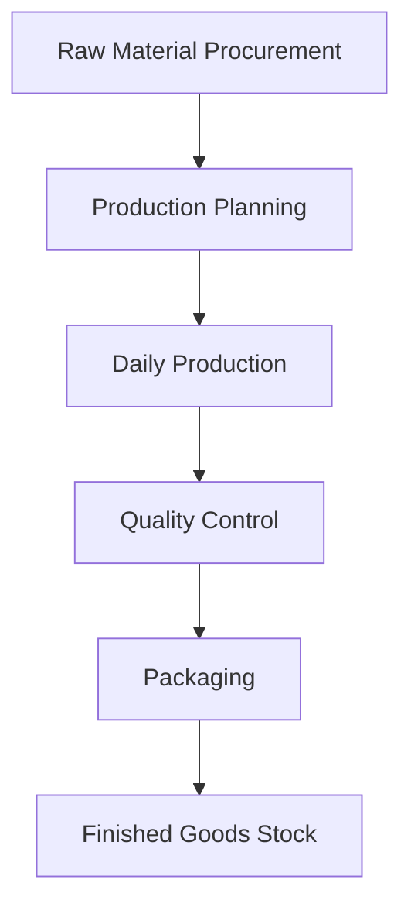
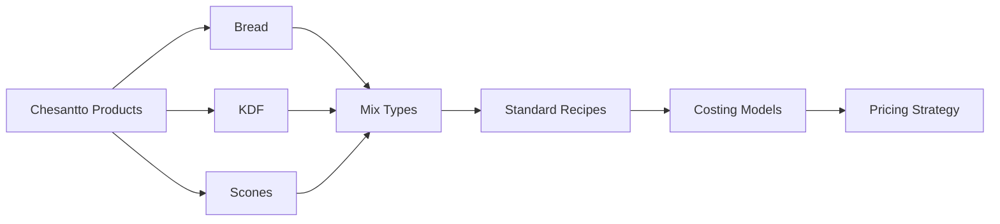
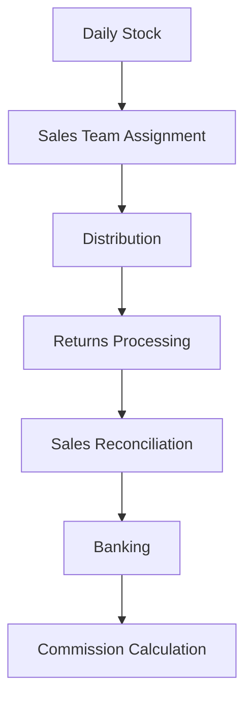
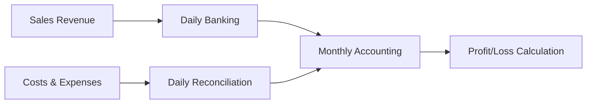
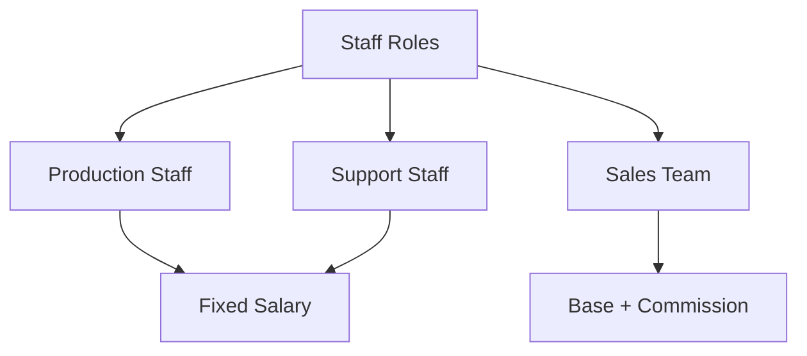

# Chesantto Bakery - Operational Cognitive Map

## 1. Core Production Operations

## 2. Product Lines

## 3. Sales & Distribution Flow

## 4. Financial Flow

## 5. Staff Management

## Current Operational Model

### 1. Supply Chain Management
- Raw material procurement
- Inventory level monitoring
- Supplier relationships
- Stock reconciliation
- Reorder management

### 2. Production Process
- Daily production planning
- Recipe standardization
- Quality control
- Packaging management
- Waste monitoring

### 3. Sales Operations
- Territory management
- Sales team deployment
- Product distribution
- Returns handling
- Banking reconciliation

### 4. Financial Management
- Daily revenue tracking
- Expense monitoring
- Banking management
- Salary processing
- Commission calculations

### 5. Human Resource Structure
- Defined roles
- Clear responsibilities
- Performance tracking
- Compensation management
- Attendance monitoring

## Key Business Metrics

### Production Metrics
- Daily production volumes
- Raw material usage
- Packaging material consumption
- Production costs
- Quality standards

### Sales Metrics
- Daily sales targets
- Returns percentage
- Banking accuracy
- Commission earnings
- Territory performance

### Financial Metrics
- Daily revenue
- Monthly profit/loss
- Operating costs
- Staff expenses
- Commission payouts

## Integration Points

### 1. Production-Sales Link
- Production volumes based on sales trends
- Returns influence next day's production
- Quality affects sales performance

### 2. Sales-Finance Link
- Daily banking reconciliation
- Commission calculations
- Revenue tracking
- Deficit management

### 3. Finance-Operations Link
- Cost control
- Budget management
- Expense tracking
- Salary processing

This cognitive map represents the current operational state of Chesantto Bakery, showing how different aspects of the business interact and support each other in daily operations.