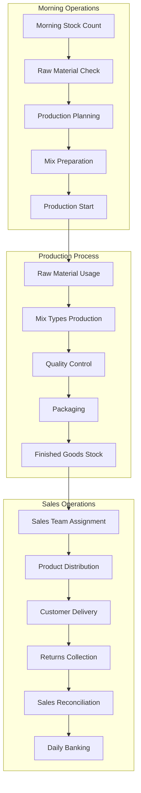
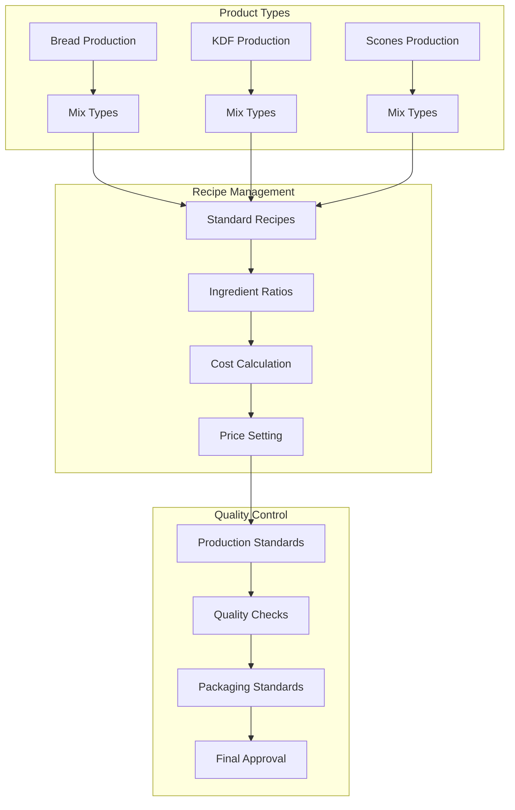
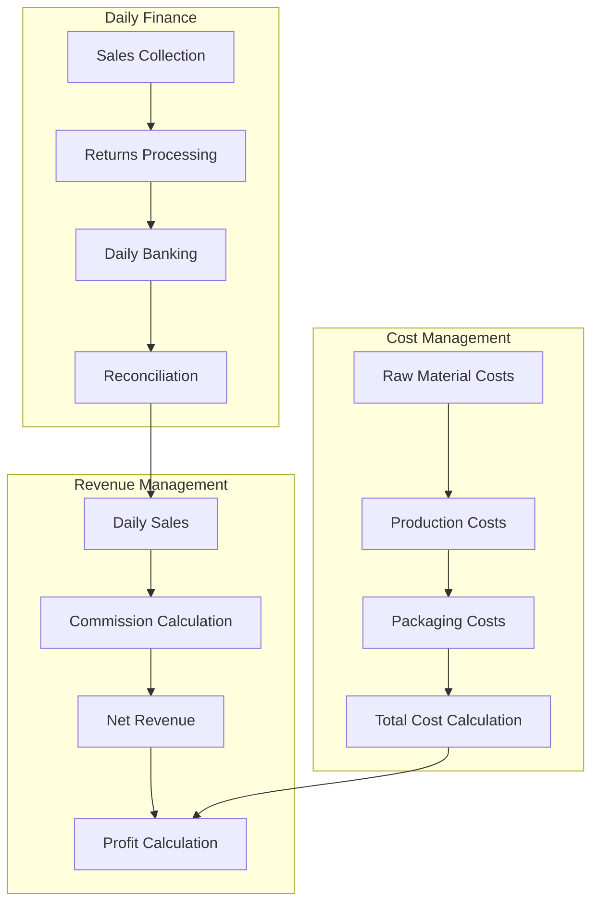
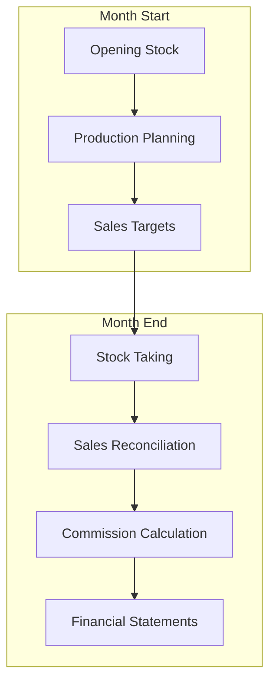

# Chesantto Bakery System - Complete Operational Flow

## 1. Daily Operations Cycle



## 2. Product Management Flow



## 3. Financial Flow System



## 4. Excel Sheet Dependencies

### Sheet Relationships
1. **Primary Data Sources:**
   - Sheet 4 (Production): Records all production details
   - Sheet 6 (Dispatch and Sales): Tracks daily sales
   - Sheet 8 (Closing Stock Inventory): Manages raw materials

2. **Derived Data:**
   - Sheet 2 (P&L): Gets data from Sheets 3, 4, 6, 10
   - Sheet 3 (Monthly Summary): Aggregates from Sheets 4, 6
   - Sheet 12 (Deficits): References Sheet 6

3. **Supporting Sheets:**
   - Sheet 5 (Packaging): Links to Sheet 4
   - Sheet 7 (Closing Stock): Links to Sheets 4, 6
   - Sheet 13 (Commissions): References Sheet 6

### Data Flow Between Sheets
1. **Production Flow:**
   ```
   Raw Materials (Sheet 8) → Production (Sheet 4) → Packaging (Sheet 5) → Stock (Sheet 7)
   ```

2. **Sales Flow:**
   ```
   Stock (Sheet 7) → Sales (Sheet 6) → Banking → Commissions (Sheet 13)
   ```

3. **Financial Flow:**
   ```
   Daily Sales (Sheet 6) → Monthly Summary (Sheet 3) → P&L (Sheet 2)
   ```

## 5. Business Process Dependencies

### A. Production Dependencies
1. **Raw Materials → Production**
   - Inventory levels determine production capacity
   - Mix types depend on material availability
   - Quality of inputs affects product quality

2. **Production → Sales**
   - Production volume limits daily sales
   - Product quality affects returns
   - Production timing impacts distribution

### B. Financial Dependencies
1. **Sales → Banking**
   - Daily sales determine banking amounts
   - Returns affect final banking figures
   - Commission calculations based on net sales

2. **Costs → Pricing**
   - Raw material costs affect product pricing
   - Production costs influence profit margins
   - Packaging costs impact final pricing

### C. Staff Dependencies
1. **Production Staff**
   - Morning shift determines daily output
   - Quality control affects returns
   - Production efficiency impacts costs

2. **Sales Staff**
   - Territory coverage affects sales
   - Performance impacts commissions
   - Returns handling affects reconciliation

## 6. Critical Control Points

### A. Production Controls
1. **Raw Material Check**
   - Morning inventory verification (Sheet 8)
   - Quality inspection
   - Quantity confirmation

2. **Production Process**
   - Mix ratios adherence (Sheet 4)
   - Temperature control
   - Timing standards

3. **Quality Control**
   - Product standards check
   - Packaging verification (Sheet 5)
   - Batch approval

### B. Sales Controls
1. **Distribution**
   - Territory assignment (Sheet 6)
   - Product allocation
   - Returns policy

2. **Financial**
   - Sales verification
   - Banking confirmation
   - Commission calculation (Sheet 13)

## 7. Daily Workflow Timeline

### A. Morning Operations (6:00 AM - 10:00 AM)
1. Stock count and material check
2. Production planning
3. Mix preparation
4. Initial batch production
5. Quality control
6. Sales team dispatch

### B. Mid-Day Operations (10:00 AM - 2:00 PM)
1. Continuous production
2. Sales monitoring
3. Returns processing
4. Additional production if needed

### C. Evening Operations (2:00 PM - 6:00 PM)
1. Final production batch
2. Returns collection
3. Sales reconciliation
4. Banking
5. Next day planning

## 8. Monthly Cycle



This comprehensive map shows how the entire system operates, with each component's dependencies and relationships clearly defined. The system is highly integrated, with each process affecting multiple other processes in a chain reaction manner.