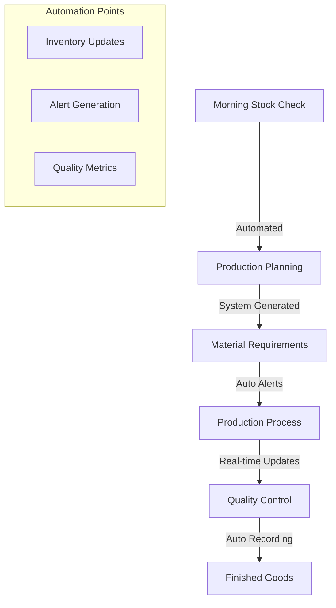
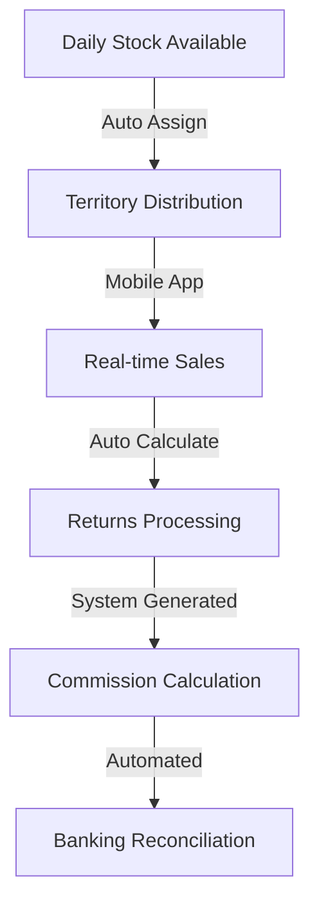

# System Design Specification

## 1. Core System Variables & Constants

### A. System Constants
```python
# Product Constants
PRODUCTS = {
    'BREAD': {
        'base_price': 60,
        'commission': 5,
        'packaging_type': 'packet',
        'mix_types': ['Mix 1', 'Mix 2', 'Mix 3']
    },
    'KDF': {
        'base_price': 100,
        'commission': 10,
        'packaging_type': 'piece',
        'mix_types': ['Mix 1', 'Mix 2']
    },
    'SCONES': {
        'base_price': 50,
        'commission': 5,
        'packaging_type': 'piece',
        'mix_types': ['Mix 1', 'Mix 2']
    }
}

# System Settings
SETTINGS = {
    'working_hours': {
        'start': '06:00',
        'end': '18:00'
    },
    'banking_deadline': '16:00',
    'stock_threshold_percentage': 20,
    'commission_calculation_frequency': 'daily',
    'report_generation_time': '17:00'
}

# User Roles
ROLES = {
    'ADMIN': 'admin',
    'MANAGER': 'manager',
    'ACCOUNTANT': 'accountant',
    'PRODUCTION': 'production',
    'SALES': 'sales',
    'INVENTORY': 'inventory'
}
```

### B. Dynamic Variables
```python
# Production Variables
production_variables = {
    'raw_material_costs': {},
    'current_batch_numbers': {},
    'quality_metrics': {},
    'efficiency_rates': {}
}

# Sales Variables
sales_variables = {
    'daily_targets': {},
    'territory_assignments': {},
    'return_rates': {},
    'customer_pricing': {}
}

# Financial Variables
financial_variables = {
    'commission_rates': {},
    'profit_margins': {},
    'cost_factors': {},
    'banking_totals': {}
}
```

## 2. User Authentication & Authorization

### A. Custom User Model
```python
# users/models.py
class ChesantoUser(AbstractUser):
    email = models.EmailField(unique=True)
    employee_id = models.CharField(max_length=10, unique=True)
    role = models.CharField(max_length=20, choices=ROLE_CHOICES)
    department = models.CharField(max_length=50)
    is_active = models.BooleanField(default=True)
    
    # Custom fields for different roles
    territory = models.ForeignKey('Territory', null=True, blank=True)
    commission_rate = models.DecimalField(max_digits=5, decimal_places=2)
    
    USERNAME_FIELD = 'email'
    REQUIRED_FIELDS = ['employee_id', 'role']
```

### B. Permission Sets
```python
# permissions.py
PERMISSIONS = {
    'ADMIN': {
        'can_manage_users': True,
        'can_view_all_reports': True,
        'can_modify_settings': True
    },
    'MANAGER': {
        'can_approve_production': True,
        'can_view_reports': True,
        'can_manage_staff': True
    },
    'PRODUCTION': {
        'can_record_production': True,
        'can_view_inventory': True,
        'can_update_recipes': True
    },
    'SALES': {
        'can_record_sales': True,
        'can_process_returns': True,
        'can_view_commission': True
    }
}
```

## 3. Automated Workflows

### A. Production Workflow


### B. Sales Workflow


## 4. Data Processing Flows

### A. Input Sources
1. **Production Inputs**
   ```python
   class ProductionInput:
       batch_number: str
       product_type: str
       mix_type: str
       raw_materials: Dict[str, float]
       start_time: datetime
       operator: str
   ```

2. **Sales Inputs**
   ```python
   class SalesTransaction:
       sales_id: str
       salesperson: str
       product_details: List[Dict]
       customer_type: str
       payment_method: str
       territory: str
   ```

3. **Inventory Inputs**
   ```python
   class InventoryUpdate:
       item_code: str
       quantity: float
       transaction_type: str
       reference: str
       timestamp: datetime
   ```

### B. Processing Rules
1. **Production Processing**
   ```python
   def process_production(batch: ProductionInput):
       # 1. Validate raw materials availability
       # 2. Update inventory
       # 3. Track production metrics
       # 4. Generate quality control checks
       # 5. Update finished goods stock
   ```

2. **Sales Processing**
   ```python
   def process_sale(transaction: SalesTransaction):
       # 1. Validate stock availability
       # 2. Calculate pricing
       # 3. Process commission
       # 4. Update inventory
       # 5. Generate banking entry
   ```

### C. Output Generation
1. **Real-time Dashboards**
   ```python
   class DashboardData:
       production_status: Dict
       sales_performance: Dict
       inventory_levels: Dict
       financial_metrics: Dict
   ```

2. **Automated Reports**
   ```python
   class ReportGenerator:
       def generate_daily_reports(self):
           # 1. Production summary
           # 2. Sales report
           # 3. Banking reconciliation
           # 4. Inventory status

       def generate_monthly_reports(self):
           # 1. P&L statement
           # 2. Performance metrics
           # 3. Commission statements
           # 4. Trend analysis
   ```

## 5. Database Schema

### A. Core Tables
```sql
-- Production Schema
CREATE TABLE products (
    product_id SERIAL PRIMARY KEY,
    name VARCHAR(100),
    base_price DECIMAL(10,2),
    commission_rate DECIMAL(5,2),
    mix_types JSONB,
    created_at TIMESTAMP DEFAULT CURRENT_TIMESTAMP
);

-- Inventory Schema
CREATE TABLE inventory (
    item_id SERIAL PRIMARY KEY,
    name VARCHAR(100),
    category VARCHAR(50),
    unit VARCHAR(20),
    current_quantity DECIMAL(10,2),
    reorder_level DECIMAL(10,2)
);

-- Sales Schema
CREATE TABLE sales (
    sale_id SERIAL PRIMARY KEY,
    salesperson_id INTEGER REFERENCES users(id),
    transaction_date TIMESTAMP,
    total_amount DECIMAL(10,2),
    commission_amount DECIMAL(10,2),
    payment_status VARCHAR(20)
);
```

### B. Transaction Tables
```sql
-- Production Transactions
CREATE TABLE production_batches (
    batch_id SERIAL PRIMARY KEY,
    product_id INTEGER REFERENCES products(id),
    quantity_produced INTEGER,
    quality_score DECIMAL(5,2),
    production_date TIMESTAMP,
    operator_id INTEGER REFERENCES users(id)
);

-- Sales Transactions
CREATE TABLE sales_details (
    detail_id SERIAL PRIMARY KEY,
    sale_id INTEGER REFERENCES sales(id),
    product_id INTEGER REFERENCES products(id),
    quantity INTEGER,
    unit_price DECIMAL(10,2),
    commission_rate DECIMAL(5,2)
);
```

## 6. API Endpoints

### A. Authentication Endpoints
```python
# Authentication URLs
urlpatterns = [
    path('auth/login/', LoginView.as_view()),
    path('auth/logout/', LogoutView.as_view()),
    path('auth/reset-password/', PasswordResetView.as_view()),
    path('auth/user-profile/', UserProfileView.as_view()),
]
```

### B. Core Operation Endpoints
```python
# API URLs
urlpatterns = [
    # Production Endpoints
    path('api/production/batch/', ProductionBatchView.as_view()),
    path('api/production/quality-check/', QualityCheckView.as_view()),
    
    # Sales Endpoints
    path('api/sales/transaction/', SalesTransactionView.as_view()),
    path('api/sales/returns/', ReturnsProcessingView.as_view()),
    
    # Inventory Endpoints
    path('api/inventory/stock-level/', StockLevelView.as_view()),
    path('api/inventory/movement/', StockMovementView.as_view()),
    
    # Report Endpoints
    path('api/reports/daily/', DailyReportView.as_view()),
    path('api/reports/monthly/', MonthlyReportView.as_view()),
]
```

## 7. Automated Reports

### A. Report Types
1. **Daily Operational Reports**
   - Production Summary
   - Sales Performance
   - Banking Reconciliation
   - Stock Movement

2. **Monthly Management Reports**
   - Financial Performance
   - Staff Performance
   - Trend Analysis
   - Cost Analysis

### B. Report Generation
```python
class ReportScheduler:
    @scheduled_task('17:00')
    def generate_daily_reports(self):
        reports = [
            ProductionReport(),
            SalesReport(),
            BankingReport(),
            InventoryReport()
        ]
        for report in reports:
            report.generate()
            report.distribute()

    @scheduled_task('monthly')
    def generate_monthly_reports(self):
        reports = [
            FinancialReport(),
            PerformanceReport(),
            TrendAnalysisReport()
        ]
        for report in reports:
            report.generate()
            report.distribute()
```

## 8. Mobile Integration

### A. Mobile Features
1. **Sales Team App**
   - Real-time order processing
   - Territory mapping
   - Returns processing
   - Commission tracking

2. **Production App**
   - Production tracking
   - Quality control
   - Inventory updates
   - Batch management

### B. Mobile API Endpoints
```python
# Mobile API URLs
urlpatterns = [
    path('api/mobile/sales/', MobileSalesView.as_view()),
    path('api/mobile/production/', MobileProductionView.as_view()),
    path('api/mobile/inventory/', MobileInventoryView.as_view()),
]
```

This specification provides a comprehensive foundation for building the automated system. Would you like me to elaborate on any specific aspect?