# 📦 PRODUCTS APP - WORKFLOWS & INTERACTIONS

> **Complete Technical Specification for Product Catalog & Recipe Management**

**Document Version:** 3.0  
**Last Updated:** November 29, 2025  
**Status:** Technical Specification (Ready for Implementation)

---

## 📋 TABLE OF CONTENTS

1. [Overview](#1-overview)
2. [Core Responsibilities](#2-core-responsibilities)
3. [Data Models](#3-data-models)
4. [Architecture Decisions](#4-architecture-decisions)
5. [Workflow Reference](#5-workflow-reference)
6. [Admin Interactions](#6-admin-interactions)
7. [Cross-App Integration](#7-cross-app-integration)
8. [Service Layer](#8-service-layer)
9. [Seeding Strategy](#9-seeding-strategy)
10. [Data Integrity & ACID Compliance](#10-data-integrity--acid-compliance)
11. [User Flows (Frontend)](#11-user-flows-frontend)
12. [Views & Utilities Summary](#12-views--utilities-summary)
13. [Key Principles](#13-key-principles)
14. [Validation Rules](#14-validation-rules)
15. [Decimal Precision & Rounding](#15-decimal-precision--rounding)
16. [Testing](#16-testing)
17. [Implementation Checklist](#17-implementation-checklist)

---

## 1. OVERVIEW

### What is the Products App?

The **Products App** is the **recipe and catalog management foundation** for Chesanto Bakery. It defines:
- **What** the bakery produces (Products)
- **How** to produce it (Mixes/Recipes)
- **What ingredients** are needed (MixIngredients → Inventory link)

### Why Products App Matters

```
┌─────────────────────────────────────────────────────────────────┐
│                    FOUNDATION APPS LAYER                        │
├─────────────────┬─────────────────┬─────────────────┬───────────┤
│   INVENTORY     │    PRODUCTS     │   PRODUCTION    │   SALES   │
│   (23 items)    │  (Catalog/Mix)  │   (Batches)     │  (Orders) │
│                 │                 │                 │           │
│  Raw materials  │  What to make   │  Making it      │  Selling  │
│  Ingredients    │  Recipes/yields │  Stock tracking │  Revenue  │
└────────┬────────┴────────┬────────┴────────┬────────┴─────┬─────┘
         │                 │                 │              │
         └─────────────────┴─────────────────┴──────────────┘
                    Data flows LEFT → RIGHT
```

### Core Principle: Static Reference + Editable Recipes

Unlike Inventory (where history is critical), Products app is:
- **Reference data** - "What CAN we make?"
- **Editable** - Recipes can be updated as the business evolves
- **Soft-deletable** - Archived, never hard-deleted (historical integrity)

---

## 2. CORE RESPONSIBILITIES

### Products App DOES:

| Responsibility | Description |
|---------------|-------------|
| **Define Products** | Master catalog of all bakery items |
| **Manage Recipes** | Mix ingredients with quantities |
| **Link to Inventory** | MixIngredient → inventory_item_id routing |
| **Support Sub-products** | Quality tiers (Bread → Bread Leftovers) |
| **Archive Management** | Soft delete with is_active flag |

### Products App DOES NOT:

| Not Responsible For | Handled By |
|--------------------|------------|
| Track production batches | Production App |
| Manage inventory levels | Inventory App |
| Handle sales/orders | Sales App |
| Calculate costs | Production App (at batch time) |

---

## 3. DATA MODELS

### 3.1 Product Model

**Purpose:** Master catalog of all bakery products

```python
# apps/products/models.py

class Product(models.Model):
    """
    Master catalog of bakery products.
    
    Supports sub-products via self-referential FK for quality tiers.
    Example: Bread (parent) → Bread Leftovers (child)
    """
    
    name = models.CharField(
        max_length=100,
        unique=True,
        help_text="Product name (e.g., 'Bread', 'Scones', 'KDF')"
    )
    
    parent_product = models.ForeignKey(
        'self',
        on_delete=models.PROTECT,
        null=True,
        blank=True,
        related_name='sub_products',
        help_text="Parent product for quality tiers (e.g., Bread Leftovers → Bread)"
    )
    
    selling_price = models.DecimalField(
        max_digits=10,
        decimal_places=2,
        validators=[MinValueValidator(Decimal('0.01'))],
        help_text="Current selling price per packet/unit"
    )
    
    description = models.TextField(
        blank=True,
        help_text="Optional product description"
    )
    
    is_active = models.BooleanField(
        default=True,
        db_index=True,
        help_text="False = archived, not available for new production"
    )
    
    # Audit fields
    created_at = models.DateTimeField(auto_now_add=True)
    updated_at = models.DateTimeField(auto_now=True)
    created_by = models.ForeignKey(
        'accounts.User',
        on_delete=models.PROTECT,
        related_name='products_created'
    )
    updated_by = models.ForeignKey(
        'accounts.User',
        on_delete=models.PROTECT,
        null=True,
        blank=True,
        related_name='products_updated'
    )
    
    class Meta:
        ordering = ['name']
        indexes = [
            models.Index(fields=['is_active', 'name']),
        ]
    
    def __str__(self):
        return f"{self.name} (KES {self.selling_price})"
    
    def archive(self, user):
        """Soft delete - set is_active=False"""
        self.is_active = False
        self.updated_by = user
        self.save(update_fields=['is_active', 'updated_by', 'updated_at'])
    
    def restore(self, user):
        """Restore archived product"""
        self.is_active = True
        self.updated_by = user
        self.save(update_fields=['is_active', 'updated_by', 'updated_at'])
```

**Pre-seeded Products:**
```
ID | Name           | Parent | Price | Notes
---|----------------|--------|-------|---------------------------
1  | Bread          | NULL   | 60    | Main product, fixed yield
2  | Bread Leftovers| 1      | 50    | Sub-product of Bread
3  | Scones         | NULL   | 45    | Main product, fixed yield
4  | Scones Leftovers| 3     | 40    | Sub-product of Scones
5  | KDF            | NULL   | 35    | Main product, variable yield
6  | KDF Leftovers  | 5      | 30    | Sub-product of KDF
```

---

### 3.2 Mix Model

**Purpose:** Recipe definition - what ingredients make a product

```python
# apps/products/models.py

class Mix(models.Model):
    """
    Recipe for producing a product.
    
    Each product has ONE active mix at a time.
    Mixes can be edited in place (no versioning).
    """
    
    product = models.ForeignKey(
        Product,
        on_delete=models.PROTECT,
        related_name='mixes',
        help_text="Which product this recipe produces"
    )
    
    name = models.CharField(
        max_length=100,
        help_text="Recipe name (e.g., 'Bread Mix Standard')"
    )
    
    expected_yield = models.DecimalField(
        max_digits=10,
        decimal_places=2,
        validators=[MinValueValidator(Decimal('1'))],
        help_text="Expected packets/units produced per mix"
    )
    
    is_fixed_yield = models.BooleanField(
        default=True,
        help_text="True = machine-weighed (exact), False = hand-cut (variable)"
    )
    
    yield_variance_min = models.DecimalField(
        max_digits=10,
        decimal_places=2,
        null=True,
        blank=True,
        help_text="Minimum expected yield (for variable yield products)"
    )
    
    yield_variance_max = models.DecimalField(
        max_digits=10,
        decimal_places=2,
        null=True,
        blank=True,
        help_text="Maximum expected yield (for variable yield products)"
    )
    
    is_active = models.BooleanField(
        default=True,
        db_index=True,
        help_text="Only ONE active mix per product"
    )
    
    notes = models.TextField(
        blank=True,
        help_text="Recipe notes, special instructions"
    )
    
    # Audit fields
    created_at = models.DateTimeField(auto_now_add=True)
    updated_at = models.DateTimeField(auto_now=True)
    created_by = models.ForeignKey(
        'accounts.User',
        on_delete=models.PROTECT,
        related_name='mixes_created'
    )
    updated_by = models.ForeignKey(
        'accounts.User',
        on_delete=models.PROTECT,
        null=True,
        blank=True,
        related_name='mixes_updated'
    )
    
    class Meta:
        verbose_name_plural = "Mixes"
        ordering = ['product__name', 'name']
        constraints = [
            # Only one active mix per product
            models.UniqueConstraint(
                fields=['product'],
                condition=models.Q(is_active=True),
                name='unique_active_mix_per_product'
            ),
        ]
    
    def __str__(self):
        status = "✓" if self.is_active else "✗"
        return f"{self.name} ({status}) → {self.expected_yield} units"
    
    def archive(self, user):
        """Soft delete - set is_active=False"""
        self.is_active = False
        self.updated_by = user
        self.save(update_fields=['is_active', 'updated_by', 'updated_at'])
```

**Pre-seeded Mixes:**
```
ID | Product | Name                 | Yield | Fixed? | Variance
---|---------|----------------------|-------|--------|------------
1  | Bread   | Bread Mix Standard   | 132   | Yes    | N/A
2  | Scones  | Scones Mix Standard  | 102   | Yes    | N/A
3  | KDF     | KDF Mix Standard     | 102   | No     | 97-107
```

---

### 3.3 MixIngredient Model

**Purpose:** Through-table linking Mix → Inventory items with quantities

**Critical Design Decision: IntegerField for inventory_item_id**

```python
# apps/products/models.py

class MixIngredient(models.Model):
    """
    Links a Mix to Inventory items with required quantities.
    
    Uses IntegerField for inventory_item_id (1-23) which routes
    to the appropriate per-item inventory table at runtime.
    
    Example: inventory_item_id=1 → Flour Type 1 table
             inventory_item_id=17 → Packaging table
    """
    
    mix = models.ForeignKey(
        Mix,
        on_delete=models.CASCADE,  # Delete ingredients if mix deleted
        related_name='ingredients',
        help_text="Which recipe this ingredient belongs to"
    )
    
    # ROUTING FIELD - maps to Inventory per-item tables
    inventory_item_id = models.IntegerField(
        validators=[
            MinValueValidator(1),
            MaxValueValidator(23)
        ],
        help_text="ID mapping to inventory item (1-23). See INVENTORY_APP_WORKFLOWS.md"
    )
    
    quantity_required = models.DecimalField(
        max_digits=10,
        decimal_places=4,
        validators=[MinValueValidator(Decimal('0.0001'))],
        help_text="Amount needed per mix in base units"
    )
    
    unit_of_measure = models.CharField(
        max_length=20,
        help_text="Base unit (kg, L, units) - must match inventory item"
    )
    
    notes = models.TextField(
        blank=True,
        help_text="Special instructions (e.g., 'sifted flour')"
    )
    
    # Audit
    created_at = models.DateTimeField(auto_now_add=True)
    
    class Meta:
        ordering = ['inventory_item_id']
        constraints = [
            # Each ingredient appears once per mix
            models.UniqueConstraint(
                fields=['mix', 'inventory_item_id'],
                name='unique_ingredient_per_mix'
            ),
        ]
    
    def __str__(self):
        return f"{self.get_inventory_item_name()} ({self.quantity_required} {self.unit_of_measure})"
    
    def get_inventory_item_name(self):
        """Get human-readable name from Inventory routing"""
        from apps.inventory.routing import get_item_info
        try:
            item_info = get_item_info(self.inventory_item_id)
            return item_info[1]  # (id, name, is_ingredient, unit)
        except ValueError:
            return f"Unknown ({self.inventory_item_id})"
    
    def is_ingredient(self):
        """Check if this is a direct ingredient (items 1-15)"""
        from apps.inventory.routing import is_ingredient
        return is_ingredient(self.inventory_item_id)
    
    def is_indirect_cost(self):
        """Check if this is an indirect cost (items 16-23)"""
        from apps.inventory.routing import is_indirect_cost
        return is_indirect_cost(self.inventory_item_id)
```

**Inventory Item Reference (from INVENTORY_APP_WORKFLOWS.md):**
```
INGREDIENTS (items 1-15) - Deducted by Production:
  01. Flour Type 1 (kg)
  02. Flour Type 2 (kg)
  03. Sugar (kg)
  04. Bread Improver (kg)
  05. Salt (kg)
  06. Calcium (kg)
  07. Yeast (kg)
  08. Yeast 2-in-1 (kg)
  09. Baking Powder (kg)
  10. Margarine (kg)
  11. Milk (L)
  12. Eggs (units)
  13. Cooking Fat (kg)
  14. Cooking Oil (L)
  15. Food Colour (kg)

INDIRECT COSTS (items 16-23) - Manual consumption tracking:
  16. Crates (units)
  17. Packaging (units)
  18. Diesel (L)
  19. Firewood (units)
  20. Fuel Bolero (units)
  21. Electricity (tokens)
  22. Fuel for Transport Trucks (L)
  23. Hair Nets (units)
```

**Example Mix Ingredients (Bread Mix Standard):**
```
Mix: "Bread Mix Standard" (ID=1) - Expected Yield: 132 packets
│
├── inventory_item_id=1  (Flour Type 1)   | 36.000 kg
├── inventory_item_id=3  (Sugar)          | 4.500 kg
├── inventory_item_id=4  (Bread Improver) | 0.060 kg (60g)
├── inventory_item_id=5  (Salt)           | 0.280 kg (280g)
├── inventory_item_id=6  (Calcium)        | 0.070 kg (70g)
├── inventory_item_id=7  (Yeast)          | 0.200 kg (200g)
└── inventory_item_id=13 (Cooking Fat)    | 2.800 kg
```

**Scones Mix Standard (ID=2) - Expected Yield: 102 packets:**
```
├── inventory_item_id=1  (Flour Type 1)   | 26.000 kg
├── inventory_item_id=3  (Sugar)          | 3.800 kg
├── inventory_item_id=4  (Bread Improver) | 0.050 kg (50g)
├── inventory_item_id=5  (Salt)           | 0.280 kg (280g)
├── inventory_item_id=6  (Calcium)        | 0.050 kg (50g)
├── inventory_item_id=7  (Yeast)          | 0.190 kg (190g)
└── inventory_item_id=13 (Cooking Fat)    | 2.300 kg
```

**KDF Mix Standard (ID=3) - Expected Yield: 102 packets (variable 97-107):**
```
├── inventory_item_id=1  (Flour Type 1)   | 50.000 kg
├── inventory_item_id=3  (Sugar)          | 2.500 kg
├── inventory_item_id=5  (Salt)           | 0.300 kg (300g)
├── inventory_item_id=6  (Calcium)        | 0.060 kg (60g)
├── inventory_item_id=7  (Yeast)          | 0.160 kg (160g)
├── inventory_item_id=13 (Cooking Fat)    | 1.500 kg
└── inventory_item_id=14 (Cooking Oil)    | 7.500 L
```

---

## 4. ARCHITECTURE DECISIONS

### 4.1 Standard Django Models (Not Per-Item Tables)

**Decision:** Use standard Django ORM models for Product, Mix, MixIngredient

**Rationale:**
- Products app is a **catalog** (small dataset, rarely changes)
- Unlike Inventory (23 separate tables for performance), Products uses normal ForeignKeys
- Maximum ~10-20 products, ~10-20 mixes, ~200 mix ingredients
- No performance benefit from per-item tables

**Contrast with Inventory:**
```
INVENTORY APP:                    PRODUCTS APP:
├── Flour (separate table)        ├── Product (single table)
├── Sugar (separate table)        ├── Mix (single table)
├── Salt (separate table)         └── MixIngredient (single table)
├── ... (23 total)                    └── Uses inventory_item_id for routing
```

---

### 4.2 IntegerField for Inventory Routing

**Decision:** MixIngredient uses `inventory_item_id` (IntegerField 1-23) instead of ForeignKey

**Rationale:**
- Inventory uses **per-item tables** (no generic InventoryItem model to FK to)
- IntegerField maps to the routing system in Inventory app
- Production app uses same routing to deduct ingredients

**Flow:**
```
MixIngredient.inventory_item_id = 1
         │
         ▼
INVENTORY_ITEM_MAPPING[1] = "Flour"
         │
         ▼
get_inventory_model_for_item(1) → Flour model class
         │
         ▼
Flour.objects.filter(...) → Actual inventory operations
```

---

### 4.3 Soft Delete / Archive Pattern

**Decision:** Never hard-delete Products or Mixes; use `is_active=False`

**Rationale:**
- Historical production batches reference products/mixes
- Sales records reference products
- Deleting would break referential integrity
- Archiving preserves data while hiding from active operations

**Implementation:**
```python
# Archive (soft delete)
product.archive(user=request.user)  # Sets is_active=False

# Restore
product.restore(user=request.user)  # Sets is_active=True

# Query active only
Product.objects.filter(is_active=True)

# Query all (including archived)
Product.objects.all()
```

---

### 4.4 Pre-seeded Core Products

**Decision:** Seed core products at migration time; admin can create new ones

**Core Products (Pre-seeded):**
```
1. Bread          (parent=NULL)
2. Bread Leftovers (parent=Bread)
3. Scones         (parent=NULL)
4. Scones Leftovers (parent=Scones)
5. KDF            (parent=NULL)
6. KDF Leftovers  (parent=KDF)
```

**Admin-Created Products:**
- New product types can be added via admin interface
- Follow same patterns (optional parent for sub-products)
- Automatically get ID > 6

---

## 5. WORKFLOW REFERENCE

### 5.1 Product Workflows

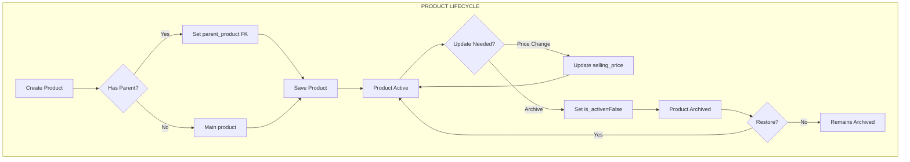

#### Create Product Flow

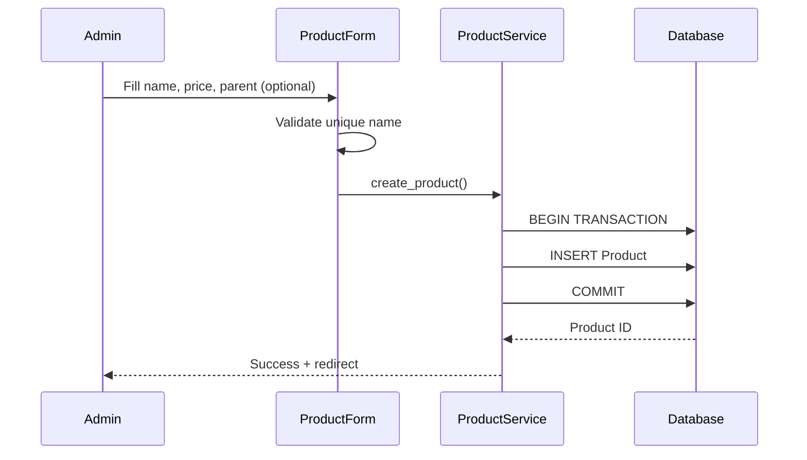

#### Update Product Price Flow

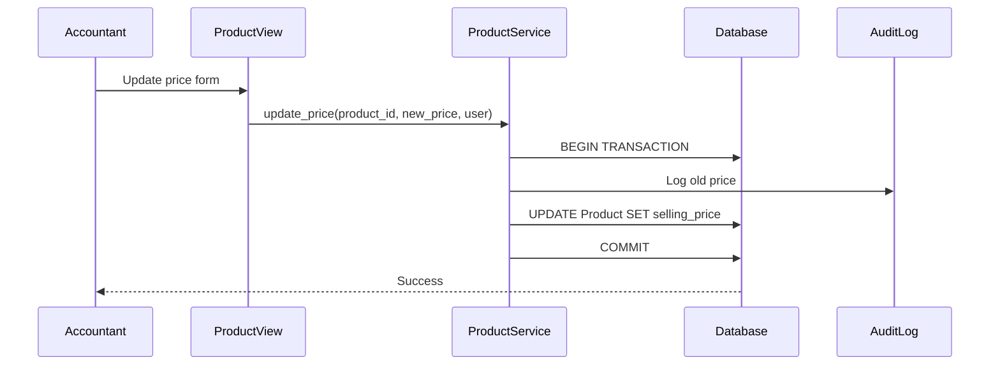

---

### 5.2 Mix (Recipe) Workflows

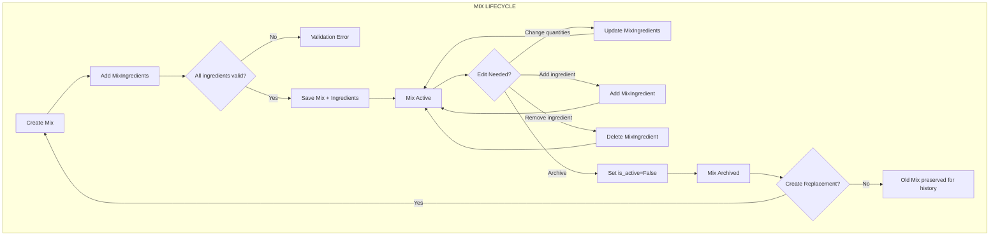

#### Create Mix Flow

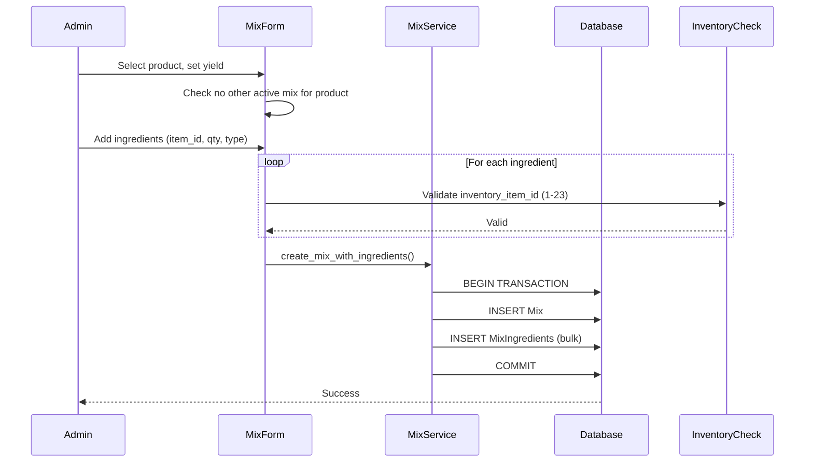

#### Edit Mix Ingredients Flow

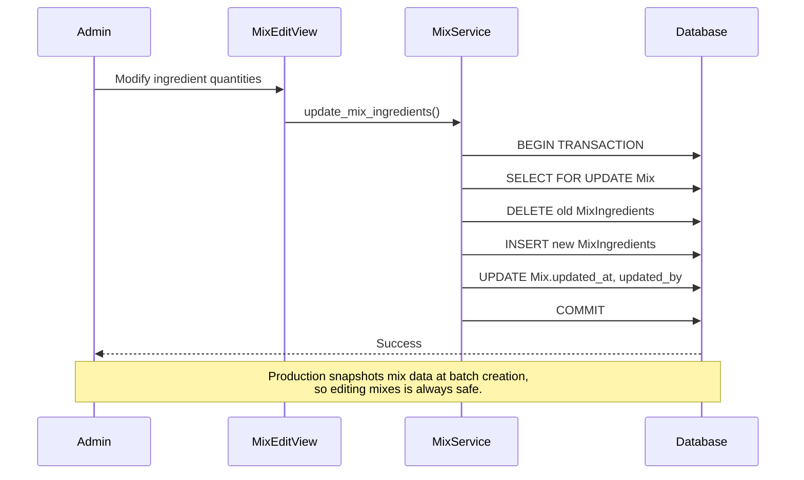

---

### 5.3 Complete User Flows

#### Admin Creates New Product with Recipe

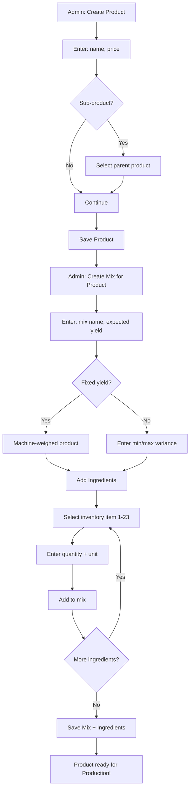

**Note:** Ingredient type (Direct/Indirect) is derived from `inventory_item_id`:
- Items 1-15 = Ingredients (deducted by Production)
- Items 16-23 = Indirect Costs (manual tracking)

---

## 6. ADMIN INTERACTIONS

### 6.1 Django Admin Configuration

```python
# apps/products/admin.py

from django.contrib import admin
from .models import Product, Mix, MixIngredient


class MixIngredientInline(admin.TabularInline):
    """Inline editor for mix ingredients"""
    model = MixIngredient
    extra = 1
    fields = ['inventory_item_id', 'quantity_required', 'unit_of_measure', 'notes']
    readonly_fields = []


@admin.register(Product)
class ProductAdmin(admin.ModelAdmin):
    list_display = ['name', 'selling_price', 'parent_product', 'is_active', 'updated_at']
    list_filter = ['is_active', 'parent_product']
    search_fields = ['name']
    readonly_fields = ['created_at', 'updated_at', 'created_by', 'updated_by']
    
    fieldsets = (
        (None, {
            'fields': ('name', 'selling_price', 'description')
        }),
        ('Hierarchy', {
            'fields': ('parent_product',)
        }),
        ('Status', {
            'fields': ('is_active',)
        }),
        ('Audit', {
            'fields': ('created_at', 'created_by', 'updated_at', 'updated_by'),
            'classes': ('collapse',)
        }),
    )
    
    def save_model(self, request, obj, form, change):
        if not change:  # New object
            obj.created_by = request.user
        obj.updated_by = request.user
        super().save_model(request, obj, form, change)


@admin.register(Mix)
class MixAdmin(admin.ModelAdmin):
    list_display = ['name', 'product', 'expected_yield', 'is_fixed_yield', 'is_active']
    list_filter = ['is_active', 'is_fixed_yield', 'product']
    search_fields = ['name', 'product__name']
    inlines = [MixIngredientInline]
    readonly_fields = ['created_at', 'updated_at', 'created_by', 'updated_by']
    
    fieldsets = (
        (None, {
            'fields': ('product', 'name')
        }),
        ('Yield Configuration', {
            'fields': ('expected_yield', 'is_fixed_yield', 'yield_variance_min', 'yield_variance_max')
        }),
        ('Status', {
            'fields': ('is_active', 'notes')
        }),
        ('Audit', {
            'fields': ('created_at', 'created_by', 'updated_at', 'updated_by'),
            'classes': ('collapse',)
        }),
    )
    
    def save_model(self, request, obj, form, change):
        if not change:
            obj.created_by = request.user
        obj.updated_by = request.user
        super().save_model(request, obj, form, change)
```

### 6.2 Role-Based Access

| Role | Products | Mixes | MixIngredients |
|------|----------|-------|----------------|
| **Superadmin** | Full CRUD | Full CRUD | Full CRUD |
| **Admin** | Full CRUD | Full CRUD | Full CRUD |
| **Accountant** | Update price only | View only | View only |
| **Baker** | View only | View only | View only |
| **Cashier** | View only | - | - |

---

## 7. CROSS-APP INTEGRATION

### 7.1 Products ← Inventory Integration

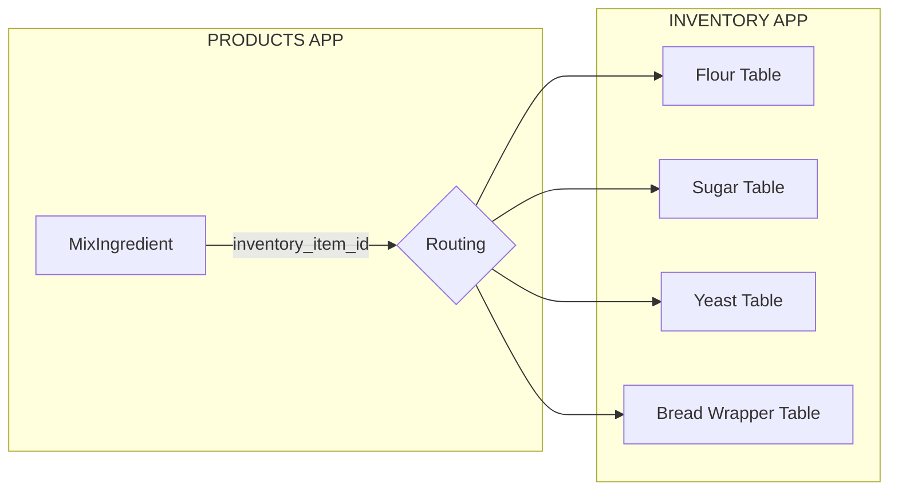

**How MixIngredient references Inventory:**
```python
# In Products app
mix_ingredient = MixIngredient.objects.get(id=1)
item_id = mix_ingredient.inventory_item_id  # e.g., 1

# Get inventory model via routing (from Inventory app)
from apps.inventory.routing import get_details_model
InventoryModel = get_details_model(item_id)  # Returns Item01FlourType1Details

# Check current stock
item_details = InventoryModel.objects.get()  # Singleton per item
current_stock = item_details.current_stock
```

---

### 7.2 Products → Production Integration

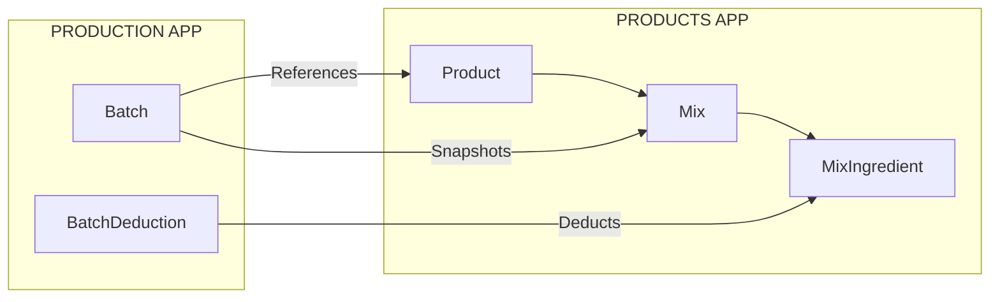

**Production reads from Products:**
```python
# When creating a production batch
product = Product.objects.get(id=1, is_active=True)
active_mix = product.mixes.get(is_active=True)
ingredients = active_mix.ingredients.all()

# Snapshot for batch (in case mix changes later)
batch.mix_snapshot = {
    'mix_id': active_mix.id,
    'mix_name': active_mix.name,
    'expected_yield': str(active_mix.expected_yield),
    'ingredients': [
        {
            'inventory_item_id': ing.inventory_item_id,
            'quantity': str(ing.quantity_required),
            'unit': ing.unit_of_measure
        }
        for ing in ingredients
    ]
}
```

---

### 7.3 Products → Sales Integration

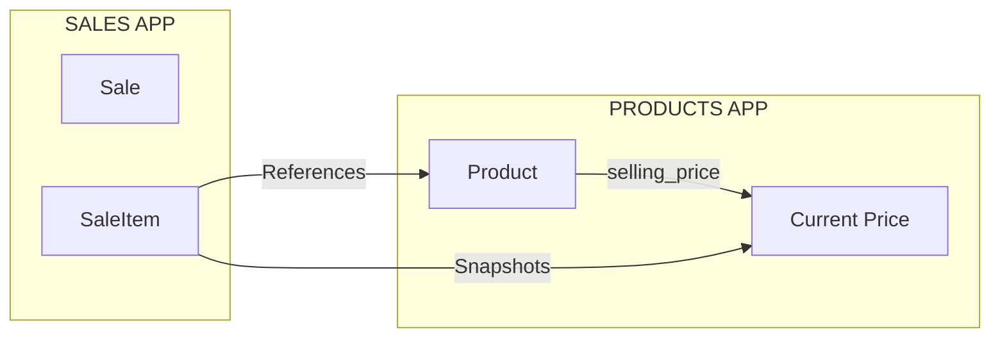

**Sales reads product price:**
```python
# When creating a sale
product = Product.objects.get(id=1, is_active=True)
sale_item.product = product
sale_item.unit_price = product.selling_price  # Snapshot at sale time
sale_item.quantity = 10
sale_item.total = sale_item.unit_price * sale_item.quantity
```

---

## 8. SERVICE LAYER

### 8.1 Product Services

```python
# apps/products/services.py

from django.db import transaction
from django.core.exceptions import ValidationError
from .models import Product, Mix, MixIngredient


class ProductService:
    """Business logic for Product operations"""
    
    @staticmethod
    @transaction.atomic
    def create_product(name: str, selling_price: Decimal, created_by, 
                       parent_product_id: int = None, description: str = "") -> Product:
        """
        Create a new product with validation.
        
        Raises:
            ValidationError: If name already exists or parent invalid
        """
        if Product.objects.filter(name__iexact=name).exists():
            raise ValidationError(f"Product '{name}' already exists")
        
        parent = None
        if parent_product_id:
            parent = Product.objects.get(id=parent_product_id, is_active=True)
        
        product = Product.objects.create(
            name=name,
            selling_price=selling_price,
            parent_product=parent,
            description=description,
            created_by=created_by
        )
        
        return product
    
    @staticmethod
    @transaction.atomic
    def update_price(product_id: int, new_price: Decimal, updated_by) -> Product:
        """
        Update product selling price with audit trail.
        """
        product = Product.objects.select_for_update().get(id=product_id)
        
        if new_price <= 0:
            raise ValidationError("Price must be positive")
        
        old_price = product.selling_price
        product.selling_price = new_price
        product.updated_by = updated_by
        product.save()
        
        # Audit log (if audit app exists)
        # AuditLog.log_price_change(product, old_price, new_price, updated_by)
        
        return product
    
    @staticmethod
    @transaction.atomic
    def archive_product(product_id: int, archived_by) -> Product:
        """
        Soft delete a product.
        
        Note: Does NOT affect historical production/sales records.
        """
        product = Product.objects.select_for_update().get(id=product_id)
        
        # Check for active mixes - archive them too
        active_mixes = product.mixes.filter(is_active=True)
        for mix in active_mixes:
            MixService.archive_mix(mix.id, archived_by)
        
        product.archive(archived_by)
        return product
```

### 8.2 Mix Services

```python
# apps/products/services.py (continued)

class MixService:
    """Business logic for Mix/Recipe operations"""
    
    @staticmethod
    @transaction.atomic
    def create_mix_with_ingredients(
        product_id: int,
        name: str,
        expected_yield: Decimal,
        is_fixed_yield: bool,
        ingredients: list[dict],
        created_by,
        yield_variance_min: Decimal = None,
        yield_variance_max: Decimal = None,
        notes: str = ""
    ) -> Mix:
        """
        Create a mix with its ingredients atomically.
        
        Args:
            ingredients: List of dicts with keys:
                - inventory_item_id (int 1-23)
                - quantity_required (Decimal)
                - unit_of_measure (str)
                - notes (str, optional)
        
        Raises:
            ValidationError: If product already has active mix
        """
        product = Product.objects.get(id=product_id, is_active=True)
        
        # Check for existing active mix
        if product.mixes.filter(is_active=True).exists():
            raise ValidationError(
                f"Product '{product.name}' already has an active mix. "
                "Archive it first before creating a new one."
            )
        
        # Validate all ingredients
        for ing in ingredients:
            if not 1 <= ing['inventory_item_id'] <= 23:
                raise ValidationError(
                    f"Invalid inventory_item_id: {ing['inventory_item_id']}. Must be 1-23."
                )
        
        # Create mix
        mix = Mix.objects.create(
            product=product,
            name=name,
            expected_yield=expected_yield,
            is_fixed_yield=is_fixed_yield,
            yield_variance_min=yield_variance_min,
            yield_variance_max=yield_variance_max,
            notes=notes,
            created_by=created_by
        )
        
        # Create ingredients
        mix_ingredients = [
            MixIngredient(
                mix=mix,
                inventory_item_id=ing['inventory_item_id'],
                quantity_required=ing['quantity_required'],
                unit_of_measure=ing['unit_of_measure'],
                notes=ing.get('notes', '')
            )
            for ing in ingredients
        ]
        MixIngredient.objects.bulk_create(mix_ingredients)
        
        return mix
    
    @staticmethod
    @transaction.atomic
    def update_mix_ingredients(mix_id: int, ingredients: list[dict], updated_by) -> Mix:
        """
        Update mix ingredients (replace all).
        
        Note: Production snapshots mix data at batch creation time,
        so editing mixes is always safe - no blocking needed.
        """
        mix = Mix.objects.select_for_update().get(id=mix_id)
        
        # Validate all ingredients
        for ing in ingredients:
            if not 1 <= ing['inventory_item_id'] <= 23:
                raise ValidationError(
                    f"Invalid inventory_item_id: {ing['inventory_item_id']}. Must be 1-23."
                )
        
        # Delete existing and create new
        mix.ingredients.all().delete()
        
        mix_ingredients = [
            MixIngredient(
                mix=mix,
                inventory_item_id=ing['inventory_item_id'],
                quantity_required=ing['quantity_required'],
                unit_of_measure=ing['unit_of_measure'],
                notes=ing.get('notes', '')
            )
            for ing in ingredients
        ]
        MixIngredient.objects.bulk_create(mix_ingredients)
        
        mix.updated_by = updated_by
        mix.save()
        
        return mix
    
    @staticmethod
    @transaction.atomic
    def archive_mix(mix_id: int, archived_by) -> Mix:
        """Soft delete a mix."""
        mix = Mix.objects.select_for_update().get(id=mix_id)
        mix.archive(archived_by)
        return mix
    
    @staticmethod
    def get_active_mix_for_product(product_id: int) -> dict:
        """
        Get active mix data for Production app.
        Returns dict (not model instance) for loose coupling.
        """
        try:
            product = Product.objects.get(id=product_id, is_active=True)
            mix = product.mixes.get(is_active=True)
            ingredients = mix.ingredients.all()
            
            return {
                'success': True,
                'data': {
                    'product_id': product.id,
                    'product_name': product.name,
                    'selling_price': str(product.selling_price),
                    'mix_id': mix.id,
                    'mix_name': mix.name,
                    'expected_yield': str(mix.expected_yield),
                    'is_fixed_yield': mix.is_fixed_yield,
                    'yield_variance_min': str(mix.yield_variance_min) if mix.yield_variance_min else None,
                    'yield_variance_max': str(mix.yield_variance_max) if mix.yield_variance_max else None,
                    'ingredients': [
                        {
                            'inventory_item_id': ing.inventory_item_id,
                            'quantity_required': str(ing.quantity_required),
                            'unit_of_measure': ing.unit_of_measure,
                        }
                        for ing in ingredients
                    ]
                }
            }
        except Product.DoesNotExist:
            return {'success': False, 'error': f'Product {product_id} not found or inactive'}
        except Mix.DoesNotExist:
            return {'success': False, 'error': f'No active mix for product {product_id}'}
```

---

## 9. SEEDING STRATEGY

### 9.1 Migration-Time Seeding

```python
# apps/products/migrations/0002_seed_core_products.py

from django.db import migrations
from decimal import Decimal


def seed_products(apps, schema_editor):
    """Seed core products at migration time"""
    Product = apps.get_model('products', 'Product')
    
    # Get or create system user for audit
    User = apps.get_model('accounts', 'User')
    system_user = User.objects.filter(is_superuser=True).first()
    
    products_data = [
        {'name': 'Bread', 'selling_price': Decimal('60.00'), 'parent_id': None},
        {'name': 'Scones', 'selling_price': Decimal('45.00'), 'parent_id': None},
        {'name': 'KDF', 'selling_price': Decimal('35.00'), 'parent_id': None},
    ]
    
    for data in products_data:
        Product.objects.get_or_create(
            name=data['name'],
            defaults={
                'selling_price': data['selling_price'],
                'created_by': system_user
            }
        )
    
    # Create sub-products after parents exist
    bread = Product.objects.get(name='Bread')
    scones = Product.objects.get(name='Scones')
    kdf = Product.objects.get(name='KDF')
    
    sub_products = [
        {'name': 'Bread Leftovers', 'selling_price': Decimal('50.00'), 'parent': bread},
        {'name': 'Scones Leftovers', 'selling_price': Decimal('40.00'), 'parent': scones},
        {'name': 'KDF Leftovers', 'selling_price': Decimal('30.00'), 'parent': kdf},
    ]
    
    for data in sub_products:
        Product.objects.get_or_create(
            name=data['name'],
            defaults={
                'selling_price': data['selling_price'],
                'parent_product': data['parent'],
                'created_by': system_user
            }
        )


def reverse_seed(apps, schema_editor):
    """Reverse seeding - for rollback"""
    Product = apps.get_model('products', 'Product')
    Product.objects.filter(
        name__in=['Bread', 'Bread Leftovers', 'Scones', 'Scones Leftovers', 'KDF', 'KDF Leftovers']
    ).delete()


class Migration(migrations.Migration):
    dependencies = [
        ('products', '0001_initial'),
        ('accounts', '0001_initial'),
    ]
    
    operations = [
        migrations.RunPython(seed_products, reverse_seed),
    ]
```

### 9.2 Mix Seeding (Separate Migration)

```python
# apps/products/migrations/0003_seed_mixes.py

from django.db import migrations
from decimal import Decimal


def seed_mixes(apps, schema_editor):
    """Seed core mixes with ingredients using actual bakery recipes"""
    Product = apps.get_model('products', 'Product')
    Mix = apps.get_model('products', 'Mix')
    MixIngredient = apps.get_model('products', 'MixIngredient')
    User = apps.get_model('accounts', 'User')
    
    system_user = User.objects.filter(is_superuser=True).first()
    
    # ===== BREAD MIX =====
    bread = Product.objects.get(name='Bread')
    bread_mix, _ = Mix.objects.get_or_create(
        product=bread,
        name='Bread Mix Standard',
        defaults={
            'expected_yield': Decimal('132'),
            'is_fixed_yield': True,
            'created_by': system_user
        }
    )
    
    # Bread ingredients (all in kg - convert grams to kg)
    bread_ingredients = [
        {'inventory_item_id': 1, 'quantity_required': Decimal('36.000'), 'unit_of_measure': 'kg'},    # Flour Type 1
        {'inventory_item_id': 3, 'quantity_required': Decimal('4.500'), 'unit_of_measure': 'kg'},     # Sugar
        {'inventory_item_id': 4, 'quantity_required': Decimal('0.060'), 'unit_of_measure': 'kg'},     # Bread Improver (60g)
        {'inventory_item_id': 5, 'quantity_required': Decimal('0.280'), 'unit_of_measure': 'kg'},     # Salt (280g)
        {'inventory_item_id': 6, 'quantity_required': Decimal('0.070'), 'unit_of_measure': 'kg'},     # Calcium (70g)
        {'inventory_item_id': 7, 'quantity_required': Decimal('0.200'), 'unit_of_measure': 'kg'},     # Yeast (200g)
        {'inventory_item_id': 13, 'quantity_required': Decimal('2.800'), 'unit_of_measure': 'kg'},    # Cooking Fat
    ]
    
    for ing in bread_ingredients:
        MixIngredient.objects.get_or_create(
            mix=bread_mix,
            inventory_item_id=ing['inventory_item_id'],
            defaults=ing
        )
    
    # ===== SCONES MIX =====
    scones = Product.objects.get(name='Scones')
    scones_mix, _ = Mix.objects.get_or_create(
        product=scones,
        name='Scones Mix Standard',
        defaults={
            'expected_yield': Decimal('102'),
            'is_fixed_yield': True,
            'created_by': system_user
        }
    )
    
    # Scones ingredients (all in kg)
    scones_ingredients = [
        {'inventory_item_id': 1, 'quantity_required': Decimal('26.000'), 'unit_of_measure': 'kg'},    # Flour Type 1
        {'inventory_item_id': 3, 'quantity_required': Decimal('3.800'), 'unit_of_measure': 'kg'},     # Sugar
        {'inventory_item_id': 4, 'quantity_required': Decimal('0.050'), 'unit_of_measure': 'kg'},     # Bread Improver (50g)
        {'inventory_item_id': 5, 'quantity_required': Decimal('0.280'), 'unit_of_measure': 'kg'},     # Salt (280g)
        {'inventory_item_id': 6, 'quantity_required': Decimal('0.050'), 'unit_of_measure': 'kg'},     # Calcium (50g)
        {'inventory_item_id': 7, 'quantity_required': Decimal('0.190'), 'unit_of_measure': 'kg'},     # Yeast (190g)
        {'inventory_item_id': 13, 'quantity_required': Decimal('2.300'), 'unit_of_measure': 'kg'},    # Cooking Fat
    ]
    
    for ing in scones_ingredients:
        MixIngredient.objects.get_or_create(
            mix=scones_mix,
            inventory_item_id=ing['inventory_item_id'],
            defaults=ing
        )
    
    # ===== KDF MIX =====
    kdf = Product.objects.get(name='KDF')
    kdf_mix, _ = Mix.objects.get_or_create(
        product=kdf,
        name='KDF Mix Standard',
        defaults={
            'expected_yield': Decimal('102'),
            'is_fixed_yield': False,  # Variable yield (hand-cut)
            'yield_variance_min': Decimal('97'),
            'yield_variance_max': Decimal('107'),
            'created_by': system_user
        }
    )
    
    # KDF ingredients (kg for solids, L for liquids)
    kdf_ingredients = [
        {'inventory_item_id': 1, 'quantity_required': Decimal('50.000'), 'unit_of_measure': 'kg'},    # Flour Type 1
        {'inventory_item_id': 3, 'quantity_required': Decimal('2.500'), 'unit_of_measure': 'kg'},     # Sugar
        {'inventory_item_id': 5, 'quantity_required': Decimal('0.300'), 'unit_of_measure': 'kg'},     # Salt (300g)
        {'inventory_item_id': 6, 'quantity_required': Decimal('0.060'), 'unit_of_measure': 'kg'},     # Calcium (60g)
        {'inventory_item_id': 7, 'quantity_required': Decimal('0.160'), 'unit_of_measure': 'kg'},     # Yeast (160g)
        {'inventory_item_id': 13, 'quantity_required': Decimal('1.500'), 'unit_of_measure': 'kg'},    # Cooking Fat
        {'inventory_item_id': 14, 'quantity_required': Decimal('7.500'), 'unit_of_measure': 'L'},     # Cooking Oil
    ]
    
    for ing in kdf_ingredients:
        MixIngredient.objects.get_or_create(
            mix=kdf_mix,
            inventory_item_id=ing['inventory_item_id'],
            defaults=ing
        )


def reverse_seed(apps, schema_editor):
    """Reverse seeding - for rollback"""
    Mix = apps.get_model('products', 'Mix')
    Mix.objects.filter(
        name__in=['Bread Mix Standard', 'Scones Mix Standard', 'KDF Mix Standard']
    ).delete()


class Migration(migrations.Migration):
    dependencies = [
        ('products', '0002_seed_core_products'),
        ('accounts', '0001_initial'),
    ]
    
    operations = [
        migrations.RunPython(seed_mixes, reverse_seed),
    ]
```

---

## 10. DATA INTEGRITY & ACID COMPLIANCE

### 10.1 Transaction Boundaries

| Operation | Transaction Scope | Isolation Level |
|-----------|------------------|-----------------|
| Create Product | Single product | READ COMMITTED |
| Update Price | Single product | READ COMMITTED |
| Create Mix + Ingredients | Mix + all ingredients | READ COMMITTED |
| Update Mix Ingredients | Delete old + create new | READ COMMITTED |
| Archive Product | Product + related mixes | READ COMMITTED |

### 10.2 Referential Integrity

```python
# Cascading behavior
Product:
  - parent_product → PROTECT (cannot delete parent if children exist)
  - created_by → PROTECT (cannot delete user who created products)

Mix:
  - product → PROTECT (cannot delete product if mixes exist)
  - created_by → PROTECT

MixIngredient:
  - mix → CASCADE (delete ingredients when mix deleted)
```

### 10.3 Data Integrity Guarantees

| Guarantee | Implementation |
|-----------|----------------|
| **Unique product names** | `unique=True` constraint |
| **One active mix per product** | UniqueConstraint with condition |
| **Valid inventory IDs** | Validators (1-23 range) |
| **Positive prices** | MinValueValidator |
| **No orphan ingredients** | CASCADE delete on mix |
| **Audit trail** | created_by, updated_by, timestamps |

### 10.4 Soft Delete Cascade

```python
def archive_product(product, user):
    """
    When archiving a product:
    1. Archive all active mixes
    2. Archive the product
    3. MixIngredients preserved (tied to archived mixes)
    """
    with transaction.atomic():
        # Archive mixes first
        for mix in product.mixes.filter(is_active=True):
            mix.archive(user)
        
        # Then archive product
        product.archive(user)
```

---

## 11. USER FLOWS (FRONTEND)

While primary management is via Django Admin, these views support baker/cashier read access.

### 11.1 Product List View

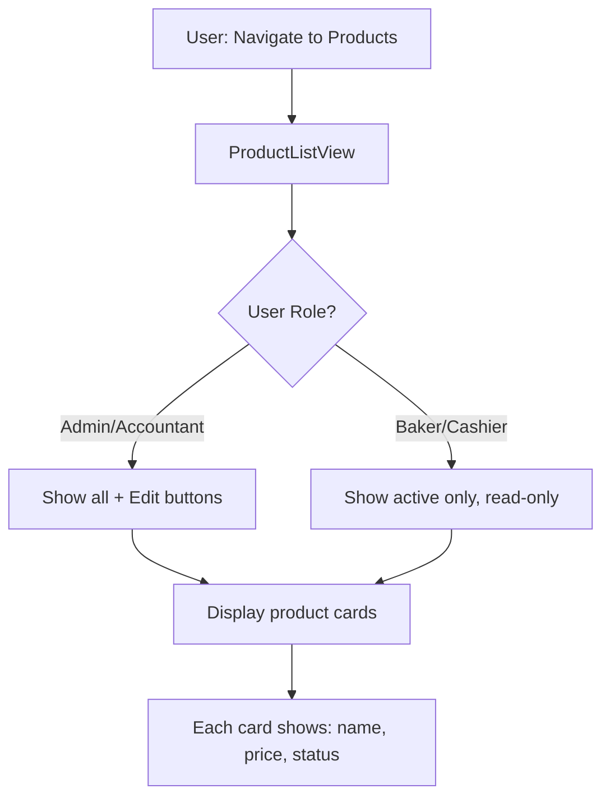

### 11.2 Product Detail View

```mermaid
flowchart TD
    A[User: Click product] --> B[ProductDetailView]
    B --> C[Load Product + Active Mix]
    C --> D[Display product info]
    D --> E[Display mix ingredients]
    E --> F{Has active mix?}
    F -->|Yes| G[Show ingredient list with quantities]
    F -->|No| H[Show "No recipe defined"]
```

### 11.3 Price Update Flow (Accountant)

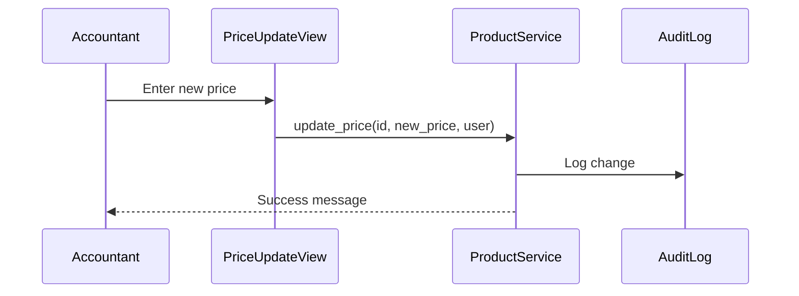

---

## 12. VIEWS & UTILITIES SUMMARY

### 12.1 Views Summary

| View | URL | Method | Purpose | Roles |
|------|-----|--------|---------|-------|
| `ProductListView` | `/products/` | GET | List all active products | All authenticated |
| `ProductDetailView` | `/products/<id>/` | GET | Product + active mix details | All authenticated |
| `ProductCreateView` | `/products/create/` | GET, POST | Create new product | Admin only |
| `ProductUpdateView` | `/products/<id>/edit/` | GET, POST | Edit product | Admin only |
| `ProductPriceUpdateView` | `/products/<id>/price/` | GET, POST | Update selling price | Admin, Accountant |
| `ProductArchiveView` | `/products/<id>/archive/` | POST | Soft delete | Admin only |
| `MixCreateView` | `/products/<id>/mix/create/` | GET, POST | Create recipe for product | Admin only |
| `MixDetailView` | `/mixes/<id>/` | GET | View mix with ingredients | All authenticated |
| `MixUpdateView` | `/mixes/<id>/edit/` | GET, POST | Edit mix ingredients | Admin only |
| `MixArchiveView` | `/mixes/<id>/archive/` | POST | Soft delete mix | Admin only |

### 12.2 Utilities Summary

| Utility Function | Module | Purpose |
|------------------|--------|---------|
| `get_inventory_item_name(item_id)` | `apps.products.utils` | Get display name for inventory_item_id |
| `get_ingredient_category(item_id)` | `apps.products.utils` | Return 'INGREDIENT' (1-15) or 'INDIRECT_COST' (16-23) |
| `validate_inventory_item_id(item_id)` | `apps.products.validators` | Validate item_id in range 1-23 |
| `calculate_mix_cost(mix)` | `apps.products.utils` | Sum ingredient costs from Inventory |

### 12.3 URL Configuration

```python
# apps/products/urls.py

from django.urls import path
from . import views

app_name = 'products'

urlpatterns = [
    # Products
    path('', views.ProductListView.as_view(), name='list'),
    path('create/', views.ProductCreateView.as_view(), name='create'),
    path('<int:pk>/', views.ProductDetailView.as_view(), name='detail'),
    path('<int:pk>/edit/', views.ProductUpdateView.as_view(), name='update'),
    path('<int:pk>/price/', views.ProductPriceUpdateView.as_view(), name='price_update'),
    path('<int:pk>/archive/', views.ProductArchiveView.as_view(), name='archive'),
    
    # Mixes
    path('<int:product_pk>/mix/create/', views.MixCreateView.as_view(), name='mix_create'),
    path('mixes/<int:pk>/', views.MixDetailView.as_view(), name='mix_detail'),
    path('mixes/<int:pk>/edit/', views.MixUpdateView.as_view(), name='mix_update'),
    path('mixes/<int:pk>/archive/', views.MixArchiveView.as_view(), name='mix_archive'),
]
```

---

## 13. KEY PRINCIPLES

### 13.1 ACID Compliance Summary

| Principle | Products App Implementation |
|-----------|----------------------------|
| **Atomicity** | All service methods use `@transaction.atomic` |
| **Consistency** | Validators enforce data rules before save |
| **Isolation** | `select_for_update()` prevents concurrent edits |
| **Durability** | PostgreSQL WAL ensures committed data survives crashes |

### 13.2 Single Source of Truth

- **Inventory item mapping** lives in `INVENTORY_APP_WORKFLOWS.md`
- Products app uses `inventory_item_id` to route to correct Inventory tables
- Category (ingredient vs indirect cost) is **derived**, not stored

### 13.3 Immutability Pattern for Production

```
┌─────────────────────────────────────────────────────────────────┐
│ PRODUCTS (Editable)          PRODUCTION (Immutable)            │
│                                                                 │
│ Mix can be edited ───────►  Batch SNAPSHOTS mix at creation    │
│ at any time                 time. Original mix changes do      │
│                             NOT affect historical batches.     │
└─────────────────────────────────────────────────────────────────┘
```

### 13.4 Soft Delete Cascade

When archiving a Product:
1. Archive all active Mixes for that product
2. Archive the Product itself
3. MixIngredients remain (attached to archived Mixes)
4. Historical Production/Sales records remain valid

---

## 14. VALIDATION RULES

### 14.1 Consolidated Validation Table

| Field | Rule | Error Message |
|-------|------|---------------|
| `Product.name` | Unique, non-empty | "Product name already exists" |
| `Product.selling_price` | > 0, max 10 digits, 2 decimal | "Price must be positive" |
| `Product.parent_product` | Must be active if set | "Parent product must be active" |
| `Mix.expected_yield` | > 0 | "Expected yield must be positive" |
| `Mix.product` | One active mix per product | "Product already has an active mix" |
| `MixIngredient.inventory_item_id` | 1-23 inclusive | "Invalid inventory item ID" |
| `MixIngredient.quantity_required` | > 0 | "Quantity must be positive" |
| `MixIngredient.unit_of_measure` | Non-empty | "Unit of measure required" |

### 14.2 Validation Utility

```python
# apps/products/validators.py

from django.core.exceptions import ValidationError
from decimal import Decimal


def validate_inventory_item_id(value):
    """Ensure inventory_item_id is in valid range (1-23)."""
    if not isinstance(value, int) or not 1 <= value <= 23:
        raise ValidationError(
            f"Invalid inventory_item_id: {value}. Must be integer 1-23."
        )


def validate_positive_decimal(value, field_name="Value"):
    """Ensure decimal is positive."""
    if value is None or value <= Decimal('0'):
        raise ValidationError(f"{field_name} must be positive.")


def validate_unique_product_name(name, exclude_id=None):
    """Check product name uniqueness."""
    from .models import Product
    qs = Product.objects.filter(name__iexact=name)
    if exclude_id:
        qs = qs.exclude(id=exclude_id)
    if qs.exists():
        raise ValidationError(f"Product '{name}' already exists.")
```

---

## 15. DECIMAL PRECISION & ROUNDING

### 15.1 Decimal Field Configuration

| Field | max_digits | decimal_places | Reason |
|-------|------------|----------------|--------|
| `Product.selling_price` | 10 | 2 | Currency (KES) |
| `Mix.expected_yield` | 10 | 2 | Product units |
| `Mix.yield_variance_min` | 5 | 2 | Percentage or units |
| `Mix.yield_variance_max` | 5 | 2 | Percentage or units |
| `MixIngredient.quantity_required` | 10 | 4 | Precision for small quantities |

### 15.2 Rounding Strategy

```python
from decimal import Decimal, ROUND_HALF_UP

# Always round to 2 decimal places for display
def round_for_display(value: Decimal) -> Decimal:
    return value.quantize(Decimal('0.01'), rounding=ROUND_HALF_UP)

# Keep 4 decimal places for calculations
def round_for_storage(value: Decimal) -> Decimal:
    return value.quantize(Decimal('0.0001'), rounding=ROUND_HALF_UP)
```

---

## 16. TESTING

### 16.1 Test Categories

| Category | Location | Purpose |
|----------|----------|---------|
| Unit Tests | `apps/products/tests/test_models.py` | Model validation, constraints |
| Service Tests | `apps/products/tests/test_services.py` | Business logic |
| Integration Tests | `apps/products/tests/test_integration.py` | Cross-app workflows |
| Admin Tests | `apps/products/tests/test_admin.py` | Admin CRUD operations |

### 16.2 ACID Compliance Test Cases

```python
# apps/products/tests/test_acid.py

from django.test import TestCase, TransactionTestCase
from django.db import transaction, IntegrityError
from django.contrib.auth import get_user_model
from decimal import Decimal
from apps.products.models import Product, Mix, MixIngredient
from apps.products.services import ProductService, MixService

User = get_user_model()


class AtomicityTests(TransactionTestCase):
    """Test that operations are all-or-nothing."""
    
    def setUp(self):
        self.user = User.objects.create_user(
            username='testuser',
            email='test@example.com',
            password='testpass123'
        )
    
    def test_mix_creation_atomic(self):
        """If ingredient creation fails, mix should not be created."""
        product = Product.objects.create(
            name="Test Product",
            selling_price=Decimal("50.00"),
            created_by=self.user
        )
        
        # Invalid ingredient (item_id=99 out of range)
        with self.assertRaises(Exception):
            MixService.create_mix_with_ingredients(
                product_id=product.id,
                name="Test Mix",
                expected_yield=Decimal("100"),
                is_fixed_yield=True,
                ingredients=[
                    {'inventory_item_id': 1, 'quantity_required': Decimal('10.0'), 'unit_of_measure': 'kg'},
                    {'inventory_item_id': 99, 'quantity_required': Decimal('5.0'), 'unit_of_measure': 'kg'},  # Invalid!
                ],
                created_by=self.user
            )
        
        # Mix should not exist due to atomicity
        self.assertEqual(Mix.objects.count(), 0)


class IsolationTests(TransactionTestCase):
    """Test concurrent access handling."""
    
    def setUp(self):
        self.user = User.objects.create_user(
            username='testuser',
            email='test@example.com',
            password='testpass123'
        )
    
    def test_concurrent_price_update_uses_row_lock(self):
        """Verify select_for_update prevents race conditions."""
        product = Product.objects.create(
            name="Test Product",
            selling_price=Decimal("50.00"),
            created_by=self.user
        )
        
        # This test verifies the implementation uses select_for_update
        # In production, PostgreSQL handles actual locking
        updated = ProductService.update_price(
            product_id=product.id,
            new_price=Decimal("60.00"),
            updated_by=self.user
        )
        
        product.refresh_from_db()
        self.assertEqual(product.selling_price, Decimal("60.00"))


class ConsistencyTests(TestCase):
    """Test data integrity constraints."""
    
    def setUp(self):
        self.user = User.objects.create_user(
            username='testuser',
            email='test@example.com',
            password='testpass123'
        )
    
    def test_unique_product_name(self):
        """Duplicate product names should raise error."""
        Product.objects.create(
            name="Bread",
            selling_price=Decimal("50.00"),
            created_by=self.user
        )
        
        with self.assertRaises(IntegrityError):
            Product.objects.create(
                name="Bread",
                selling_price=Decimal("60.00"),
                created_by=self.user
            )
    
    def test_one_active_mix_per_product(self):
        """Only one active mix allowed per product."""
        product = Product.objects.create(
            name="Test Product",
            selling_price=Decimal("50.00"),
            created_by=self.user
        )
        
        Mix.objects.create(
            product=product,
            name="Mix 1",
            expected_yield=Decimal("100"),
            is_fixed_yield=True,
            is_active=True,
            created_by=self.user
        )
        
        # Second active mix should fail constraint
        with self.assertRaises(IntegrityError):
            Mix.objects.create(
                product=product,
                name="Mix 2",
                expected_yield=Decimal("100"),
                is_fixed_yield=True,
                is_active=True,
                created_by=self.user
            )
```

---

## 17. IMPLEMENTATION CHECKLIST

### Phase 1: Models & Migrations

- [ ] Create `apps/products/models.py` with Product, Mix, MixIngredient
- [ ] Add validators and constraints (no `ingredient_type` field)
- [ ] Create initial migration
- [ ] Create seeding migrations (products, then mixes)
- [ ] Run migrations and verify seed data

### Phase 2: Service Layer

- [ ] Create `apps/products/services.py`
- [ ] Implement ProductService (create, update_price, archive)
- [ ] Implement MixService (create_with_ingredients, update, archive)
- [ ] Add validation logic
- [ ] Write unit tests for services

### Phase 3: Admin Interface

- [ ] Create `apps/products/admin.py`
- [ ] Configure ProductAdmin with fieldsets
- [ ] Configure MixAdmin with inline MixIngredients
- [ ] Add role-based permissions
- [ ] Test admin workflows

### Phase 4: Frontend Views

- [ ] Create `apps/products/views.py` with CBVs
- [ ] Create `apps/products/urls.py` URL configuration
- [ ] ProductListView (all authenticated users)
- [ ] ProductDetailView (with active mix display)
- [ ] ProductCreateView (Admin only)
- [ ] ProductUpdateView (Admin only)
- [ ] ProductPriceUpdateView (Admin, Accountant)
- [ ] MixCreateView (Admin only)
- [ ] MixDetailView (all authenticated users)
- [ ] MixUpdateView (Admin only)
- [ ] Create templates in `apps/products/templates/products/`

### Phase 5: Integration

- [ ] Create inventory routing utilities in `apps/products/utils.py`
- [ ] Wire up to Production app (batch creation)
- [ ] Wire up to Sales app (price lookup)
- [ ] Integration tests

### Phase 6: Testing

- [ ] Unit tests for models (`test_models.py`)
- [ ] Unit tests for services (`test_services.py`)
- [ ] ACID compliance tests (`test_acid.py`)
- [ ] Integration tests (`test_integration.py`)
- [ ] Admin tests (`test_admin.py`)

### Phase 7: Documentation

- [ ] Update API documentation
- [ ] Update user guides
- [ ] Training materials for admin users

---

## APPENDIX A: INVENTORY ITEM MAPPING

Reference for `MixIngredient.inventory_item_id` values.
**Source of Truth:** `INVENTORY_APP_WORKFLOWS.md`

### INGREDIENTS (Items 1-15) — Deducted by Production

| ID | Item Name       | Unit  | Description |
|----|-----------------|-------|-------------|
| 1  | Flour Type 1    | kg    | Primary flour |
| 2  | Flour Type 2    | kg    | Secondary flour |
| 3  | Sugar           | kg    | White sugar |
| 4  | Bread Improver  | kg    | Dough enhancer |
| 5  | Salt            | kg    | Table salt |
| 6  | Calcium         | kg    | Calcium additive |
| 7  | Yeast           | kg    | Primary yeast |
| 8  | Yeast 2-in-1    | kg    | Combined yeast |
| 9  | Baking Powder   | kg    | Leavening agent |
| 10 | Margarine       | kg    | Baking fat |
| 11 | Milk            | L     | Fresh milk |
| 12 | Eggs            | units | Whole eggs |
| 13 | Cooking Fat     | kg    | Solid fat |
| 14 | Cooking Oil     | L     | Liquid oil |
| 15 | Food Colour     | kg    | Food colouring |

### INDIRECT COSTS (Items 16-23) — Manual Consumption Tracking

| ID | Item Name               | Unit   | Description |
|----|-------------------------|--------|-------------|
| 16 | Crates                  | units  | Storage/transport crates |
| 17 | Packaging               | units  | Wrappers, bags, etc. |
| 18 | Diesel                  | L      | Generator fuel |
| 19 | Firewood                | units  | Oven fuel |
| 20 | Fuel Bolero             | units  | Vehicle fuel |
| 21 | Electricity             | tokens | Power tokens |
| 22 | Fuel for Transport Trucks | L    | Distribution fuel |
| 23 | Hair Nets               | units  | Safety equipment |

### Category Derivation

```python
def get_ingredient_category(inventory_item_id: int) -> str:
    """
    Derive category from inventory_item_id.
    No need for ingredient_type field on MixIngredient.
    """
    if 1 <= inventory_item_id <= 15:
        return 'INGREDIENT'  # Deducted automatically by Production
    elif 16 <= inventory_item_id <= 23:
        return 'INDIRECT_COST'  # Manual consumption tracking
    else:
        raise ValueError(f"Invalid inventory_item_id: {inventory_item_id}")
```

---

## APPENDIX B: QUICK REFERENCE

### Creating a Product
```python
from apps.products.services import ProductService

product = ProductService.create_product(
    name="New Product",
    selling_price=Decimal("55.00"),
    created_by=request.user
)
```

### Creating a Mix with Ingredients
```python
from apps.products.services import MixService
from decimal import Decimal

# Example: Creating Bread Mix with actual recipe
mix = MixService.create_mix_with_ingredients(
    product_id=1,  # Bread
    name="Bread Mix Standard",
    expected_yield=Decimal("132"),
    is_fixed_yield=True,
    ingredients=[
        {'inventory_item_id': 1, 'quantity_required': Decimal('36.000'), 'unit_of_measure': 'kg'},   # Flour Type 1
        {'inventory_item_id': 3, 'quantity_required': Decimal('4.500'), 'unit_of_measure': 'kg'},    # Sugar
        {'inventory_item_id': 4, 'quantity_required': Decimal('0.060'), 'unit_of_measure': 'kg'},    # Bread Improver (60g)
        {'inventory_item_id': 5, 'quantity_required': Decimal('0.280'), 'unit_of_measure': 'kg'},    # Salt (280g)
        {'inventory_item_id': 6, 'quantity_required': Decimal('0.070'), 'unit_of_measure': 'kg'},    # Calcium (70g)
        {'inventory_item_id': 7, 'quantity_required': Decimal('0.200'), 'unit_of_measure': 'kg'},    # Yeast (200g)
        {'inventory_item_id': 13, 'quantity_required': Decimal('2.800'), 'unit_of_measure': 'kg'},   # Cooking Fat
    ],
    created_by=request.user
)
```

### Getting Active Mix for Product
```python
product = Product.objects.get(id=1)
active_mix = product.mixes.get(is_active=True)
ingredients = active_mix.ingredients.all()
```

### Getting Ingredient Category (Derived)
```python
def is_direct_ingredient(inventory_item_id: int) -> bool:
    """Items 1-15 are ingredients, 16-23 are indirect costs."""
    return 1 <= inventory_item_id <= 15
```

---

**Document End**

*This specification should be read alongside:*
- `INVENTORY_APP_WORKFLOWS.md` - For inventory table routing details
- `FOUNDATION_REFACTORING_PLAN.md` - For overall architecture context
